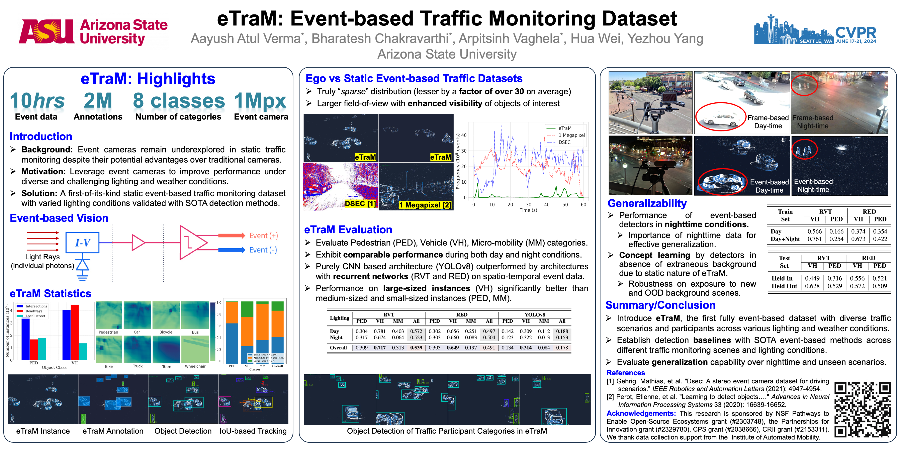
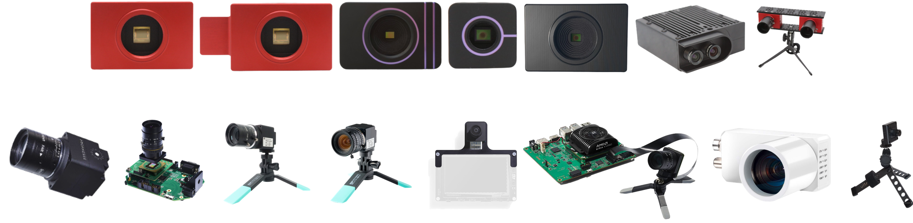

<h1 align="center">
  Event-based Vision / Dynamic Vision Sensors / Neuromorphic Vision / Event Camera - Resources
</h1>

This repository is dedicated to categorizing articles on event-based vision. While many papers are directly linked to PDFs hosted on platforms like arXiv or OpenAccess, certain articles may necessitate access through an academic license. These include publications from IEEE, Springer, Elsevier journals, and others. (Last Update on 7/27/2024)

#### Search Keywords: 
Event, event-based, event-based camera, DVS, dynamic vision sensor, neuromorphic sensor, event camera

#### Github Page Curators: 
<a href="https://chakravarthi589.github.io/" target="_blank"> Bharatesh Chakravarthi, Ph.D 
<a href="https://aayush-v.github.io/" target="_blank"> Aayush Atul Verma

#### Our Publications:
- Our Paper <a href="https://eventbasedvision.github.io/eTram" target="_blank">eTraM:</a> "Event-based Traffic Monitoring Dataset" accepted by CVPR 2024 <b> (Poster Highlight) </b>
- Our Paper <a href="https://eventbasedvision.github.io/SEVD/" target="_blank">SEVD:</a> "Synthetic Event-based Vision Dataset for Ego and Fixed Traffic Perception" accepted by CVPR 2024 Workshop on Synthetic Data for Computer Vision

    

---

## :high_brightness: Event-based Cameras

  

| Company | Cameras / Devices | Softwares/Tools |
| --------------- | --------------- |--------------- |
| <a href="https://inivation.com/" target="_blank"> iniVation </a>  | [DAVIS346](https://inivation.com/buy/) , [DAVIS346 AER](https://inivation.com/buy/),  [DVXplorer](https://inivation.com/buy/), [DVXplorer Micro](https://inivation.com/buy/)    [DVXplorer Lite](https://inivation.com/buy) [DVXplorer S Duo](https://inivation.com/buy/), [Stereo Kit](https://inivation.com/buy/)   <a href="https://inivation.com/wp-content/uploads/2023/11/2023-11-iniVation-devices-Specifications.pdf" target="_blank"> Camera Specifications / Comparisions </a> | <a href="https://docs.inivation.com/software/introduction.html" target="_blank"> Software Solutions </a> |
| <a href="https://www.prophesee.ai/" target="_blank"> Prophesee </a> | [Metavision® EVK4 – HD](https://www.prophesee.ai/event-camera-evk4/), [Metavision® EVK3 – GENX320](https://www.prophesee.ai/event-based-sensor-genx320/),    [Metavision® EVK3 – HD](https://www.prophesee.ai/event-based-evk-3/), [Metavision Starter Kit–AMD Kria KV260](https://www.prophesee.ai/event-based-evaluation-kits/),   [Metavision Starter Kit –STM32F7](https://www.prophesee.ai/event-based-sensor-genx320/#GenX320_Products)  | <a href="https://docs.prophesee.ai/stable/index.html" target="_blank"> Metavision SDK </a>| 
|  <a href="https://thinklucid.com/triton2-evs/" target="_blank"> Lucid Vision Labs - Triton2 EVS </a>  | [Triton2 EVS 0.9 MP Model (IMX636)](https://thinklucid.com/product/triton2-evs-0-9mp-imx636/), [Triton2 EVS 0.3 MP Model (IMX637)](https://thinklucid.com/product/triton2-evs-0-3mp-imx637/) |  |

---
## :high_brightness: Tools / Simulators [⤴](#event-based-cameras)

| Event-Camera Simulators |
| --------------- | 
| <b> DAVIS Simulator: </b>  An Event Camera Simulator based on Blender <a href="https://arxiv.org/pdf/1610.08336" target="_blank">[Paper]</a>&nbsp;<a href="https://github.com/uzh-rpg/rpg_davis_simulator" target="_blank">[Github]</a>&nbsp;<a href="https://rpg.ifi.uzh.ch/davis_data.html" target="_blank">[Webpage]|
| <b> ESIM: </b>  An Open Event Camera Simulator <a href="https://rpg.ifi.uzh.ch/docs/CORL18_Rebecq.pdf" target="_blank">[Paper]</a>&nbsp;<a href="https://github.com/uzh-rpg/rpg_esim" target="_blank">[Github]</a>&nbsp;<a href="https://rpg.ifi.uzh.ch/esim.html" target="_blank">[Webpage]|
| <b> v2e: </b>  From Video Frames to Realistic DVS Events <a href="https://tub-rip.github.io/eventvision2021/papers/2021CVPRW_V2E_From_Video_Frames_to_Realistic_DVS_Events.pdf" target="_blank">[Paper]</a>&nbsp;<a href="https://github.com/SensorsINI/v2e" target="_blank">[Github]</a>&nbsp;<a href="https://sites.google.com/view/video2events/home" target="_blank">[Webpage]|
| <b> ICNS Simulator: </b> Improved Event Camera Simulator via Characterized Parameters <a href="https://www.frontiersin.org/journals/neuroscience/articles/10.3389/fnins.2021.702765/full" target="_blank">[Paper]</a>&nbsp;<a href="https://github.com/neuromorphicsystems/IEBCS" target="_blank">[Github]</a>&nbsp;
| <b> V2CE Toolbox: </b> Video to Continuous Events Simulator The <a href="https://arxiv.org/pdf/2309.08891" target="_blank">[Paper]</a>&nbsp;<a href="https://github.com/ucsd-hdsi-dvs/V2CE-Toolbox" target="_blank">[Github]</a>&nbsp;
| <b> DVS-Voltmeter: </b>  Stochastic Process-based Event Simulator for Dynamic Vision Sensors <a href="https://www.ecva.net/papers/eccv_2022/papers_ECCV/papers/136670571.pdf" target="_blank">[Paper]</a>&nbsp;<a href="https://github.com/Lynn0306/DVS-Voltmeter" target="_blank">[Github]</a>|
| <b> Carla: </b>  DVS Camera <a href="https://carla.readthedocs.io/en/latest/ref_sensors/#dvs-camera" target="_blank">[Web Link]</a>|
| <b> Prophesee: </b>  Video to Event Simulator <a href="https://docs.prophesee.ai/stable/samples/modules/core_ml/viz_video_to_event_simulator.html" target="_blank">[Web Link]</a>|

---

## :high_brightness: CV Conference Papers [⤴](#event-based-cameras)
| CVPR | WACV | ECCV | ICCV |
| --------------- | --------------- | --------------- | ---------------|
| [CVPR 2024](#CVPR-2024)   [CVPR 2023](#CVPR-2023)  [CVPR 2022](#CVPR-2022)  [CVPR 2021](#CVPR-2021)  [CVPR 2020](#CVPR-2020)  [CVPR 2019](#CVPR-2019)  [CVPR 2018](#CVPR-2018)  [CVPR 2019](#CVPR-2018)  [CVPR 2017](#CVPR-2017)   [CVPR 2016](#CVPR-2016) | [WACV 2023](#WACV-2023)  [WACV 2022](#WACV-2022)  [WACV 2021](#WACV-2021)  [WACV 2020](#WACV-2020)  [WACV 2019](#WACV-2019)  [WACV 2018](#WACV-2018)  [WACV 2019](#WACV-2018)  [WACV 2017](#WACV-2017)    | [ECCV 2024](#ECCV-2024)   [ECCV 2022](#ECCV-2022)  [ECCV 2020](#ECCV-2020)  [ECCV 2018](#ECCV-2018)   [ECCV 2016](#ECCV-2016) |[ICCV 2023](#ICCV-2023)  [ICCV 2021](#ICCV-2021)  [ICCV 2019](#ICCV-2019)  [ICCV 2017](#ICCV-2017) |
---

## :high_brightness: Event-based Vision Workshop Papers [⤴](#event-based-cameras)
- [ECCV 2024-NeVI Workshop on Neuromorphic Vision: Advantages and Applications of Event Camera](#ECCVW-2024-NeVi) | [Wokshop Webpage](https://sites.google.com/view/nevi2024)
- [ECCV 2024 Workshop on Neuromorphic Vision: Neural Fields Beyond Conventional Cameras](#ECCVW-2024-neural-fields-beyond-cams) | [Workshop Webpage](https://neural-fields-beyond-cams.github.io/)
- [CVPR 2023 Workshop on Event-based Vision](#CVPRW-2023) 
- [CVPR 2021 Workshop on Event-based Vision](#CVPRW-2021) 
- [CVPR 2019 Workshop on Event-based Vision and Smart Cameras](#CVPRW-2019) 
- [ICRA 2017 Workshop on Event-based Vision](https://rpg.ifi.uzh.ch/ICRA17_event_vision_workshop.html)

---

## :high_brightness: Datasets [⤴](#event-based-cameras)

- [Realworld Event-based Datasets](#Realworld-Event-based-Datasets)   
- [Synthetic Event-based Datasets](#Synthetic-Event-based-Datasets)  
  
<!--
- Our Datasets  

| Our Datsets | Dataset Description                                                                                          | Type       | Event-Modality     | Annotations       | Object Class                  | Lighting                                 | Weather                                        |
|-------|------|----------|---------------|-------------|-----------------|------------------|--------------------|
| <a href="https://eventbasedvision.github.io/eTraM/" target="_blank"> eTraM </a>      | Fixed perception traffic monitoring data (10 Hrs)                                                                    | Real-world | Prophesee EVK4 HD  | 2D Bounding Box (~2M BB)   | Vehicle, Pedestrian, Micro-mobility  | Daytime, Nighttime, Twilight               | Clear, Rainy                                   |
| <a href="https://eventbasedvision.github.io/SEVD/" target="_blank"> SEVD        | Fixed (27 Hrs) and Ego (31 Hrs) perception Multiview Multi-Modality (Event, RGB, Depth, Optical, Semantic, Instance) traffic data      | Synthetic  | Carla DVS          | 2D & 3D Bounding Box (~9M BB)  | Vehicle, Pedestrian, Micromo-bility  | Daytime, Nighttime, Twilight, Domain shifts | Clear, Cloudy, Wet, Soft Rainy, Hard Rainy, Foggy |
-->
---

## :high_brightness: Other Papers [⤴](#event-based-cameras)
[Papers from Google Scholar using the keywords related to event-based vision](#Other-Papers)

---

## :high_brightness: Survey/Review Papers [⤴](#event-based-cameras)
- Neuromorphic Perception and Navigation for Mobile Robots: A Review <a href="//efaidnbmnnnibpcajpcglclefindmkaj/https://www.arxiv.org/pdf/2407.06792" target="_blank">[Paper]
- Event-Based Vision: A Survey <a href="https://arxiv.org/pdf/1904.08405" target="_blank">[Paper]
- Deep Learning for Event-based Vision: A Comprehensive Survey and Benchmarks <a href="https://arxiv.org/pdf/2302.08890.pdf" target="_blank">[Paper]
- Neuromorphic vision: From sensors to event-based algorithms <a href="https://wires.onlinelibrary.wiley.com/doi/epdf/10.1002/widm.1310" target="_blank">[Paper]
- Event-Based Neuromorphic Vision for Autonomous Driving: A Paradigm Shift for Bio-Inspired Visual Sensing and Perception <a href="https://ieeexplore.ieee.org/stamp/stamp.jsp?tp=&arnumber=9129849" target="_blank">[Paper]
- Exploring Neuromorphic Computing Based on Spiking Neural Networks: Algorithms to Hardware <a href="https://arxiv.org/pdf/1904.08405" target="_blank">[Paper]
- Event-Based Sensing and Signal Processing in the Visual, Auditory, and Olfactory Domain: A Review <a href="https://www.frontiersin.org/articles/10.3389/fncir.2021.610446/full" target="_blank">[Paper]
- Analytical Review of Event-Based Camera Depth Estimation Methods and Systems <a href="https://www.mdpi.com/1424-8220/22/3/1201" target="_blank">[Paper]
- Data-Driven Technology in Event-Based Vision <a href="https://www.hindawi.com/journals/complexity/2021/6689337/" target="_blank">[Paper]
- A Review of Event-Based Indoor Positioning and Navigation <a href="https://ceur-ws.org/Vol-3248/paper12.pdf" target="_blank">[Paper]
- Retinomorphic Event-Based Vision Sensors: Bioinspired Cameras With Spiking Output <a href="https://ieeexplore.ieee.org/stamp/stamp.jsp?tp=&arnumber=6887319" target="_blank">[Paper]
- A Review of Bioinspired Vision Sensors and Their Applications <a href="https://sensors.myu-group.co.jp/sm_pdf/SM1083.pdf" target="_blank">[Paper]
- Research, Applications and Prospects of Event-Based Pedestrian Detection: A Survey

## CVPR 2024 [⤴](#event-based-cameras)
- [Our paper] eTraM: Event-based Traffic Monitoring Dataset <a href="https://openaccess.thecvf.com/content/CVPR2024/papers/Verma_eTraM_Event-based_Traffic_Monitoring_Dataset_CVPR_2024_paper.pdf" target="_blank">[Paper]</a>
&nbsp;<a href="https://openaccess.thecvf.com/content/CVPR2024/supplemental/Verma_eTraM_Event-based_Traffic_CVPR_2024_supplemental.pdf" target="_blank">[Supp]</a>
- EventPS: Real-Time Photometric Stereo Using an Event Camera <b> [CVPR 2024 Honorable Paper] </b> <a href="https://openaccess.thecvf.com/content/CVPR2024/papers/Yu_EventPS_Real-Time_Photometric_Stereo_Using_an_Event_Camera_CVPR_2024_paper.pdf" target="_blank">[Paper] </a> 
-  Event Stream-based Visual Object Tracking: A High-Resolution Benchmark Dataset and A Novel Baseline <a href="https://openaccess.thecvf.com/content/CVPR2024/papers/Wang_Event_Stream-based_Visual_Object_Tracking_A_High-Resolution_Benchmark_Dataset_and_CVPR_2024_paper.pdf" target="_blank">[Paper]</a>
- State Space Models for Event Cameras <a href="https://openaccess.thecvf.com/content/CVPR2024/papers/Zubic_State_Space_Models_for_Event_Cameras_CVPR_2024_paper.pdf" target="_blank">[Paper]</a>
- OpenESS: Event-based Semantic Scene Understanding with Open Vocabularies <a href="https://openaccess.thecvf.com/content/CVPR2024/papers/Kong_OpenESS_Event-based_Semantic_Scene_Understanding_with_Open_Vocabularies_CVPR_2024_paper.pdf" target="_blank">[Paper]</a>
- A Simple and Effective Point-based Network for Event Camera 6-DOFs Pose Relocalization <a href="https://openaccess.thecvf.com/content/CVPR2024/papers/Ren_A_Simple_and_Effective_Point-based_Network_for_Event_Camera_6-DOFs_CVPR_2024_paper.pdf" target="_blank">[Paper]</a>
- Bilateral Event Mining and Complementary for Event Stream Super-Resolution <a href="https://openaccess.thecvf.com/content/CVPR2024/papers/Huang_Bilateral_Event_Mining_and_Complementary_for_Event_Stream_Super-Resolution_CVPR_2024_paper.pdf" target="_blank">[Paper]</a>
- Segment Any Event Streams via Weighted Adaptation of Pivotal Tokens <a href="https://openaccess.thecvf.com/content/CVPR2024/papers/Chen_Segment_Any_Event_Streams_via_Weighted_Adaptation_of_Pivotal_Tokens_CVPR_2024_paper.pdf" target="_blank">[Paper]</a>
- Seeing Motion at Nighttime with an Event Camera <a href="https://openaccess.thecvf.com/content/CVPR2024/papers/Liu_Seeing_Motion_at_Nighttime_with_an_Event_Camera_CVPR_2024_paper.pdf" target="_blank">[Paper]</a>
- ExACT: Language-guided Conceptual Reasoning and Uncertainty Estimation for Event-based Action Recognition and More <a href="https://openaccess.thecvf.com/content/CVPR2024/papers/Zhou_ExACT_Language-guided_Conceptual_Reasoning_and_Uncertainty_Estimation_for_Event-based_Action_CVPR_2024_paper.pdf" target="_blank">[Paper]</a>
- Low-power, Continuous Remote Behavioral Localization with Event Cameras <a href="https://openaccess.thecvf.com/content/CVPR2024/papers/Hamann_Low-power_Continuous_Remote_Behavioral_Localization_with_Event_Cameras_CVPR_2024_paper.pdf" target="_blank">[Paper]</a>
- Mitigating Motion Blur in Neural Radiance Fields with Events and Frames <a href="https://openaccess.thecvf.com/content/CVPR2024/papers/Cannici_Mitigating_Motion_Blur_in_Neural_Radiance_Fields_with_Events_and_CVPR_2024_paper.pdf" target="_blank">[Paper]</a>
- EventEgo3D: 3D Human Motion Capture from Egocentric Event Streams <a href="https://openaccess.thecvf.com/content/CVPR2024/papers/Millerdurai_EventEgo3D_3D_Human_Motion_Capture_from_Egocentric_Event_Streams_CVPR_2024_paper.pdf" target="_blank">[Paper]</a>
- Generalized Event Cameras <a href="https://openaccess.thecvf.com/content/CVPR2024/papers/Sundar_Generalized_Event_Cameras_CVPR_2024_paper.pdf" target="_blank">[Paper]</a>
- Event-based Structure-from-Orbit <a href="https://openaccess.thecvf.com/content/CVPR2024/papers/Elms_Event-based_Structure-from-Orbit_CVPR_2024_paper.pdf" target="_blank">[Paper]</a>
- CodedEvents: Optimal Point-Spread-Function Engineering for 3D-Tracking with Event Cameras <a href="https://openaccess.thecvf.com/content/CVPR2024/papers/Shah_CodedEvents_Optimal_Point-Spread-Function_Engineering_for_3D-Tracking_with_Event_Cameras_CVPR_2024_paper.pdf" target="_blank">[Paper]</a>
- Implicit Event-RGBD Neural SLAM <a href="https://openaccess.thecvf.com/content/CVPR2024/papers/Qu_Implicit_Event-RGBD_Neural_SLAM_CVPR_2024_paper.pdf" target="_blank">[Paper]</a>
- TTA-EVF: Test-Time Adaptation for Event-based Video Frame Interpolation via Reliable Pixel and Sample Estimation <a href="https://openaccess.thecvf.com/content/CVPR2024/papers/Cho_TTA-EVF_Test-Time_Adaptation_for_Event-based_Video_Frame_Interpolation_via_Reliable_CVPR_2024_paper.pdf" target="_blank">[Paper]</a>
- SD2Event: Self-supervised Learning of Dynamic Detectors and Contextual Descriptors for Event Cameras <a href="https://openaccess.thecvf.com/content/CVPR2024/papers/Gao_SD2EventSelf-supervised_Learning_of_Dynamic_Detectors_and_Contextual_Descriptors_for_Event_CVPR_2024_paper.pdf" target="_blank">[Paper]</a>
- 3D Feature Tracking via Event Camera <a href="https://openaccess.thecvf.com/content/CVPR2024/papers/Li_3D_Feature_Tracking_via_Event_Camera_CVPR_2024_paper.pdf" target="_blank">[Paper]</a>
- Frequency-aware Event-based Video Deblurring for Real-World Motion Blur <a href="https://openaccess.thecvf.com/content/CVPR2024/papers/Kim_Frequency-aware_Event-based_Video_Deblurring_for_Real-World_Motion_Blur_CVPR_2024_paper.pdf" target="_blank">[Paper]</a>
- HPL-ESS: Hybrid Pseudo-Labeling for Unsupervised Event-based Semantic Segmentation <a href="https://openaccess.thecvf.com/content/CVPR2024/papers/Jing_HPL-ESS_Hybrid_Pseudo-Labeling_for_Unsupervised_Event-based_Semantic_Segmentation_CVPR_2024_paper.pdf" target="_blank">[Paper]</a>
- EvDiG: Event-guided Direct and Global Components Separation <a href="https://openaccess.thecvf.com/content/CVPR2024/papers/Zhou_EvDiG_Event-guided_Direct_and_Global_Components_Separation_CVPR_2024_paper.pdf" target="_blank">[Paper]</a>
- Bring Event into RGB and LiDAR: Hierarchical Visual-Motion Fusion for Scene Flow <a href="https://openaccess.thecvf.com/content/CVPR2024/papers/Zhou_Bring_Event_into_RGB_and_LiDAR_Hierarchical_Visual-Motion_Fusion_for_CVPR_2024_paper.pdf" target="_blank">[Paper]</a>
- LED: A Large-scale Real-world Paired Dataset for Event Camera Denoising <a href="https://openaccess.thecvf.com/content/CVPR2024/papers/Duan_LED_A_Large-scale_Real-world_Paired_Dataset_for_Event_Camera_Denoising_CVPR_2024_paper.pdf" target="_blank">[Paper]</a>
- Video Frame Interpolation via Direct Synthesis with the Event-based Reference <a href="https://openaccess.thecvf.com/content/CVPR2024/papers/Liu_Video_Frame_Interpolation_via_Direct_Synthesis_with_the_Event-based_Reference_CVPR_2024_paper.pdf" target="_blank">[Paper]</a>
- Event-assisted Low-Light Video Object Segmentation <a href="https://openaccess.thecvf.com/content/CVPR2024/papers/Li_Event-assisted_Low-Light_Video_Object_Segmentation_CVPR_2024_paper.pdf" target="_blank">[Paper]</a>
- Scene Adaptive Sparse Transformer for Event-based Object Detection <a href="https://openaccess.thecvf.com/content/CVPR2024/papers/Peng_Scene_Adaptive_Sparse_Transformer_for_Event-based_Object_Detection_CVPR_2024_paper.pdf" target="_blank">[Paper]</a>
- Efficient Meshflow and Optical Flow Estimation from Event Cameras <a href="https://openaccess.thecvf.com/content/CVPR2024/papers/Luo_Efficient_Meshflow_and_Optical_Flow_Estimation_from_Event_Cameras_CVPR_2024_paper.pdf" target="_blank">[Paper]</a>
- Towards Robust Event-guided Low-Light Image Enhancement: A Large-Scale Real-World Event-Image Dataset and Novel Approach <a href="https://openaccess.thecvf.com/content/CVPR2024/papers/Liang_Towards_Robust_Event-guided_Low-Light_Image_Enhancement_A_Large-Scale_Real-World_Event-Image_CVPR_2024_paper.pdf" target="_blank">[Paper]</a>
- EventDance: Unsupervised Cross-modal Source-free Adaptation for Event-based Object Recognition <a href="https://openaccess.thecvf.com/content/CVPR2024/papers/Zheng_EventDance_Unsupervised_Source-free_Cross-modal_Adaptation_for_Event-based_Object_Recognition_CVPR_2024_paper.pdf" target="_blank">[Paper]</a>
- Latency Correction for Event-guided Deblurring and Frame Interpolation <a href="https://openaccess.thecvf.com/content/CVPR2024/papers/Yang_Latency_Correction_for_Event-guided_Deblurring_and_Frame_Interpolation_CVPR_2024_paper.pdf" target="_blank">[Paper]</a>
- Complementing Event Streams and RGB Frames for Hand Mesh Reconstruction <a href="https://openaccess.thecvf.com/content/CVPR2024/papers/Jiang_Complementing_Event_Streams_and_RGB_Frames_for_Hand_Mesh_Reconstruction_CVPR_2024_paper.pdf" target="_blank">[Paper]</a>
- Event-based Visible and Infrared Fusion via Multi-task Collaboration <a href="https://openaccess.thecvf.com/content/CVPR2024/papers/Geng_Event-based_Visible_and_Infrared_Fusion_via_Multi-task_Collaboration_CVPR_2024_paper.pdf" target="_blank">[Paper]</a>
- LEOD: Label-Efficient Object Detection for Event Cameras <a href="https://openaccess.thecvf.com/content/CVPR2024/papers/Wu_LEOD_Label-Efficient_Object_Detection_for_Event_Cameras_CVPR_2024_paper.pdf" target="_blank">[Paper]</a>
- An N-Point Linear Solver for Line and Motion Estimation with Event Cameras <a href="https://openaccess.thecvf.com/content/CVPR2024/papers/Gao_An_N-Point_Linear_Solver_for_Line_and_Motion_Estimation_with_CVPR_2024_paper.pdf" target="_blank">[Paper]</a>
- DMR: Decomposed Multi-Modality Representations for Frames and Events Fusion in Visual Reinforcement Learning <a href="https://openaccess.thecvf.com/content/CVPR2024/papers/Xu_DMR_Decomposed_Multi-Modality_Representations_for_Frames_and_Events_Fusion_in_CVPR_2024_paper.pdf" target="_blank">[Paper]</a>
- Time-Efficient Light-Field Acquisition Using Coded Aperture and Events <a href="https://openaccess.thecvf.com/content/CVPR2024/papers/Habuchi_Time-Efficient_Light-Field_Acquisition_Using_Coded_Aperture_and_Events_CVPR_2024_paper.pdf" target="_blank">[Paper]</a>

## CVPR 2023 [⤴](#event-based-cameras)
- EventNeRF: Neural Radiance Fields From a Single Colour Event Camera <a href="https://openaccess.thecvf.com/content/CVPR2023/papers/Rudnev_EventNeRF_Neural_Radiance_Fields_From_a_Single_Colour_Event_Camera_CVPR_2023_paper.pdf" target="_blank">[Paper]</a>&nbsp;<a href="https://4dqv.mpi-inf.mpg.de/EventNeRF/" target="_blank">[Webpage]</a>&nbsp;<a href="https://github.com/r00tman/EventNeRF" target="_blank">[Github]</a>&nbsp;<a href="https://nextcloud.mpi-klsb.mpg.de/index.php/s/xDqwRHiWKeSRyes" target="_blank">[Data]
- Progressive Spatio-Temporal Alignment for Efficient Event-Based Motion Estimation <a href="https://openaccess.thecvf.com/content/CVPR2023/papers/Huang_Progressive_Spatio-Temporal_Alignment_for_Efficient_Event-Based_Motion_Estimation_CVPR_2023_paper.pdf" target="_blank">[Paper]</a>
- Event-Based Shape From Polarization <a href="https://openaccess.thecvf.com/content/CVPR2023/papers/Muglikar_Event-Based_Shape_From_Polarization_CVPR_2023_paper.pdf" target="_blank">[Paper]</a>&nbsp;<a href="https://rpg.ifi.uzh.ch/esfp.html" target="_blank">[Webpage]</a>&nbsp;<a href="https://github.com/uzh-rpg/ESfP" target="_blank">[Github]</a>&nbsp;<a href="https://www.youtube.com/watch?v=sF3Ue2Zkpec&ab_channel=UZHRoboticsandPerceptionGroup" target="_blank">[Video]</a>&nbsp;
- Learning Spatial-Temporal Implicit Neural Representations for Event-Guided Video Super-Resolution <a href="https://openaccess.thecvf.com/content/CVPR2023/papers/Lu_Learning_Spatial-Temporal_Implicit_Neural_Representations_for_Event-Guided_Video_Super-Resolution_CVPR_2023_paper.pdf" target="_blank">[Paper]</a>&nbsp;<a href="https://vlis2022.github.io/cvpr23/egvsr" target="_blank">[Webpage]</a>&nbsp;<a href="https://github.com/yunfanLu/INR-Event-VSR" target="_blank">[Github]</a>&nbsp;<a href="https://www.youtube.com/watch?v=ty531p2Me7Q&ab_channel=ChristophenLU" target="_blank">[Video]</a>&nbsp;
- Event-Based Blurry Frame Interpolation Under Blind Exposure <a href="https://openaccess.thecvf.com/content/CVPR2023/papers/Weng_Event-Based_Blurry_Frame_Interpolation_Under_Blind_Exposure_CVPR_2023_paper.pdf" target="_blank">[Paper]</a>&nbsp;<a href="https://github.com/WarranWeng/EBFI-BE" target="_blank">[Github]</a>
- Data-Driven Feature Tracking for Event Cameras <a href="https://openaccess.thecvf.com/content/CVPR2023/papers/Messikommer_Data-Driven_Feature_Tracking_for_Event_Cameras_CVPR_2023_paper.pdf" target="_blank">[Paper]</a>&nbsp;<a href="https://github.com/uzh-rpg/deep_ev_tracker" target="_blank">[Github]</a>&nbsp;<a href="https://www.youtube.com/watch?v=dtkXvNXcWRY&ab_channel=UZHRoboticsandPerceptionGroup" target="_blank">[Video]</a>&nbsp;
- Adaptive Global Decay Process for Event Cameras <a href="https://openaccess.thecvf.com/content/CVPR2023/papers/Nunes_Adaptive_Global_Decay_Process_for_Event_Cameras_CVPR_2023_paper.pdf" target="_blank">[Paper]</a>
- Frame-Event Alignment and Fusion Network for High Frame Rate Tracking <a href="https://openaccess.thecvf.com/content/CVPR2023/papers/Zhang_Frame-Event_Alignment_and_Fusion_Network_for_High_Frame_Rate_Tracking_CVPR_2023_paper.pdf" target="_blank">[Paper]</a> 
- EvShutter: Transforming Events for Unconstrained Rolling Shutter Correction <a href="https://openaccess.thecvf.com/content/CVPR2023/papers/Erbach_EvShutter_Transforming_Events_for_Unconstrained_Rolling_Shutter_Correction_CVPR_2023_paper.pdf" target="_blank">[Paper]</a>
- Recurrent Vision Transformers for Object Detection With Event Cameras <a href="https://openaccess.thecvf.com/content/CVPR2023/papers/Gehrig_Recurrent_Vision_Transformers_for_Object_Detection_With_Event_Cameras_CVPR_2023_paper.pdf" target="_blank">[Paper]</a>
- Learning Event Guided High Dynamic Range Video Reconstruction <a href="https://openaccess.thecvf.com/content/CVPR2023/papers/Yang_Learning_Event_Guided_High_Dynamic_Range_Video_Reconstruction_CVPR_2023_paper.pdf" target="_blank">[Paper]</a>
- Tangentially Elongated Gaussian Belief Propagation for Event-Based Incremental Optical Flow Estimation <a href="https://openaccess.thecvf.com/content/CVPR2023/papers/Nagata_Tangentially_Elongated_Gaussian_Belief_Propagation_for_Event-Based_Incremental_Optical_Flow_CVPR_2023_paper.pdf" target="_blank">[Paper]</a>
- Learning Adaptive Dense Event Stereo From the Image Domain <a href="https://openaccess.thecvf.com/content/CVPR2023/papers/Cho_Learning_Adaptive_Dense_Event_Stereo_From_the_Image_Domain_CVPR_2023_paper.pdf" target="_blank">[Paper]</a>
- Event-Based Video Frame Interpolation With Cross-Modal Asymmetric Bidirectional Motion Fields <a href="https://openaccess.thecvf.com/content/CVPR2023/papers/Kim_Event-Based_Video_Frame_Interpolation_With_Cross-Modal_Asymmetric_Bidirectional_Motion_Fields_CVPR_2023_paper.pdf" target="_blank">[Paper]</a>
- Event-Guided Person Re-Identification via Sparse-Dense Complementary Learning <a href="https://openaccess.thecvf.com/content/CVPR2023/papers/Cao_Event-Guided_Person_Re-Identification_via_Sparse-Dense_Complementary_Learning_CVPR_2023_paper.pdf" target="_blank">[Paper]</a>
- High-fidelity Event-Radiance Recovery via Transient Event Frequency <a href="https://openaccess.thecvf.com/content/CVPR2023/papers/Han_High-Fidelity_Event-Radiance_Recovery_via_Transient_Event_Frequency_CVPR_2023_paper.pdf" target="_blank">[Paper]</a>
- “Seeing” Electric Network Frequency from Events <a href="https://openaccess.thecvf.com/content/CVPR2023/papers/Xu_Seeing_Electric_Network_Frequency_From_Events_CVPR_2023_paper.pdf" target="_blank">[Paper]</a>
- Deep Polarization Reconstruction with PDAVIS Events
 <a href="https://openaccess.thecvf.com/content/CVPR2023/papers/Mei_Deep_Polarization_Reconstruction_With_PDAVIS_Events_CVPR_2023_paper.pdf" target="_blank">[Paper]</a>
- Event-Based Frame Interpolation with Ad-hoc Deblurring <a href="https://openaccess.thecvf.com/content/CVPR2023/papers/Sun_Event-Based_Frame_Interpolation_With_Ad-Hoc_Deblurring_CVPR_2023_paper.pdf" target="_blank">[Paper]</a>
- All-in-focus Imaging from Event Focal Stack
 <a href="https://openaccess.thecvf.com/content/CVPR2023/papers/Lou_All-in-Focus_Imaging_From_Event_Focal_Stack_CVPR_2023_paper.pdf" target="_blank">[Paper]</a>

## CVPR 2022 [⤴](#event-based-cameras)
- A Voxel Graph CNN for Object Classification With Event Cameras <a href="https://openaccess.thecvf.com/content/CVPR2022/papers/Deng_A_Voxel_Graph_CNN_for_Object_Classification_With_Event_Cameras_CVPR_2022_paper.pdf" target="_blank">[Paper]</a>
- Event-Based Video Reconstruction via Potential-Assisted Spiking Neural Network <a href="https://openaccess.thecvf.com/content/CVPR2022/papers/Zhu_Event-Based_Video_Reconstruction_via_Potential-Assisted_Spiking_Neural_Network_CVPR_2022_paper.pdf" target="_blank">[Paper]</a>
- Spiking Transformers for Event-Based Single Object Tracking <a href="https://openaccess.thecvf.com/content/CVPR2022/papers/Zhang_Spiking_Transformers_for_Event-Based_Single_Object_Tracking_CVPR_2022_paper.pdf" target="_blank">[Paper]</a>
- Stereo Depth From Events Cameras: Concentrate and Focus on the Future <a href="https://openaccess.thecvf.com/content/CVPR2022/papers/Nam_Stereo_Depth_From_Events_Cameras_Concentrate_and_Focus_on_the_CVPR_2022_paper.pdf" target="_blank">[Paper]</a>
- Discrete Time Convolution for Fast Event-Based Stereo <a href="https://openaccess.thecvf.com/content/CVPR2022/papers/Zhang_Discrete_Time_Convolution_for_Fast_Event-Based_Stereo_CVPR_2022_paper.pdf" target="_blank">[Paper]</a>
- Event-Aided Direct Sparse Odometry <a href="https://openaccess.thecvf.com/content/CVPR2022/papers/Hidalgo-Carrio_Event-Aided_Direct_Sparse_Odometry_CVPR_2022_paper.pdf" target="_blank">[Paper]</a>
- AEGNN: Asynchronous Event-Based Graph Neural Networks <a href="https://openaccess.thecvf.com/content/CVPR2022/papers/Schaefer_AEGNN_Asynchronous_Event-Based_Graph_Neural_Networks_CVPR_2022_paper.pdf" target="_blank">[Paper]</a>
- EvUnroll: Neuromorphic Events Based Rolling Shutter Image Correction <a href="https://openaccess.thecvf.com/content/CVPR2022/papers/Zhou_EvUnroll_Neuromorphic_Events_Based_Rolling_Shutter_Image_Correction_CVPR_2022_paper.pdf" target="_blank">[Paper]</a>
- TimeReplayer: Unlocking the Potential of Event Cameras for Video Interpolation <a href="https://openaccess.thecvf.com/content/CVPR2022/papers/He_TimeReplayer_Unlocking_the_Potential_of_Event_Cameras_for_Video_Interpolation_CVPR_2022_paper.pdf" target="_blank">[Paper]</a>
- Ev-TTA: Test-Time Adaptation for Event-Based Object Recognition <a href="https://openaccess.thecvf.com/content/CVPR2022/papers/Kim_Ev-TTA_Test-Time_Adaptation_for_Event-Based_Object_Recognition_CVPR_2022_paper.pdf" target="_blank">[Paper]</a>
- Unifying Motion Deblurring and Frame Interpolation With Events <a href="https://openaccess.thecvf.com/content/CVPR2022/papers/Zhang_Unifying_Motion_Deblurring_and_Frame_Interpolation_With_Events_CVPR_2022_paper.pdf" target="_blank">[Paper]</a>
- E2(GO)MOTION: Motion Augmented Event Stream for Egocentric Action Recognition <a href="https://openaccess.thecvf.com/content/CVPR2022/papers/Plizzari_E2GOMOTION_Motion_Augmented_Event_Stream_for_Egocentric_Action_Recognition_CVPR_2022_paper.pdf" target="_blank">[Paper]</a>
- Multi-Grained Spatio-Temporal Features Perceived Network for Event-Based Lip-Reading <a href="https://openaccess.thecvf.com/content/CVPR2022/papers/Tan_Multi-Grained_Spatio-Temporal_Features_Perceived_Network_for_Event-Based_Lip-Reading_CVPR_2022_paper.pdf" target="_blank">[Paper]</a>
- Autofocus for Event Cameras <a href="https://openaccess.thecvf.com/content/CVPR2022/papers/Lin_Autofocus_for_Event_Cameras_CVPR_2022_paper.pdf" target="_blank">[Paper]</a>
- Time Lens++: Event-Based Frame Interpolation With Parametric Non-Linear Flow and Multi-Scale Fusion <a href="https://openaccess.thecvf.com/content/CVPR2022/papers/Tulyakov_Time_Lens_Event-Based_Frame_Interpolation_With_Parametric_Non-Linear_Flow_and_CVPR_2022_paper.pdf" target="_blank">[Paper]</a>
- Synthetic Aperture Imaging With Events and Frames <a href="https://openaccess.thecvf.com/content/CVPR2022/papers/Liao_Synthetic_Aperture_Imaging_With_Events_and_Frames_CVPR_2022_paper.pdf" target="_blank">[Paper]</a>

## CVPR 2021 [⤴](#event-based-cameras)
- Learning To Reconstruct High Speed and High Dynamic Range Videos From Events <a href="https://openaccess.thecvf.com/content/CVPR2021/papers/Zou_Learning_To_Reconstruct_High_Speed_and_High_Dynamic_Range_Videos_CVPR_2021_paper.pdf" target="_blank">[Paper]</a>
- EvDistill: Asynchronous Events To End-Task Learning via Bidirectional Reconstruction-Guided Cross-Modal Knowledge Distillation <a href="https://openaccess.thecvf.com/content/CVPR2021/papers/Wang_EvDistill_Asynchronous_Events_To_End-Task_Learning_via_Bidirectional_Reconstruction-Guided_Cross-Modal_CVPR_2021_paper.pdf" target="_blank">[Paper]</a>
- Back to Event Basics: Self-Supervised Learning of Image Reconstruction for Event Cameras via Photometric Constancy <a href="https://openaccess.thecvf.com/content/CVPR2021/papers/Paredes-Valles_Back_to_Event_Basics_Self-Supervised_Learning_of_Image_Reconstruction_for_CVPR_2021_paper.pdf" target="_blank">[Paper]</a>
- Spatiotemporal Registration for Event-Based Visual Odometry <a href="https://openaccess.thecvf.com/content/CVPR2021/papers/Liu_Spatiotemporal_Registration_for_Event-Based_Visual_Odometry_CVPR_2021_paper.pdf" target="_blank">[Paper]</a>
- Turning Frequency to Resolution: Video Super-Resolution via Event Cameras <a href="https://openaccess.thecvf.com/content/CVPR2021/papers/Jing_Turning_Frequency_to_Resolution_Video_Super-Resolution_via_Event_Cameras_CVPR_2021_paper.pdf" target="_blank">[Paper]</a>
- EventZoom: Learning To Denoise and Super Resolve Neuromorphic Events <a href="https://openaccess.thecvf.com/content/CVPR2021/papers/Duan_EventZoom_Learning_To_Denoise_and_Super_Resolve_Neuromorphic_Events_CVPR_2021_paper.pdf" target="_blank">[Paper]</a>
- Event-Based Synthetic Aperture Imaging With a Hybrid Network <a href="https://openaccess.thecvf.com/content/CVPR2021/papers/Zhang_Event-Based_Synthetic_Aperture_Imaging_With_a_Hybrid_Network_CVPR_2021_paper.pdf" target="_blank">[Paper]</a>
- Indoor Lighting Estimation Using an Event Camera <a href="https://openaccess.thecvf.com/content/CVPR2021/papers/Chen_Indoor_Lighting_Estimation_Using_an_Event_Camera_CVPR_2021_paper.pdf" target="_blank">[Paper]</a>
- Event-Based Bispectral Photometry Using Temporally Modulated Illumination <a href="https://openaccess.thecvf.com/content/CVPR2021/papers/Takatani_Event-Based_Bispectral_Photometry_Using_Temporally_Modulated_Illumination_CVPR_2021_paper.pdf" target="_blank">[Paper]</a>
- Time Lens: Event-Based Video Frame Interpolation <a href="https://openaccess.thecvf.com/content/CVPR2021/papers/Tulyakov_Time_Lens_Event-Based_Video_Frame_Interpolation_CVPR_2021_paper.pdf" target="_blank">[Paper]</a>

## CVPR 2020 [⤴](#event-based-cameras)
- Learning to Super Resolve Intensity Images From Events <a href="https://openaccess.thecvf.com/content_CVPR_2020/papers/I._Learning_to_Super_Resolve_Intensity_Images_From_Events_CVPR_2020_paper.pdf" target="_blank">[Paper]</a>
- Single Image Optical Flow Estimation With an Event Camera <a href="https://openaccess.thecvf.com/content_CVPR_2020/papers/Pan_Single_Image_Optical_Flow_Estimation_With_an_Event_Camera_CVPR_2020_paper.pdf" target="_blank">[Paper]</a>
- Joint Filtering of Intensity Images and Neuromorphic Events for High-Resolution Noise-Robust Imaging <a href="https://openaccess.thecvf.com/content_CVPR_2020/papers/Wang_Joint_Filtering_of_Intensity_Images_and_Neuromorphic_Events_for_High-Resolution_CVPR_2020_paper.pdf" target="_blank">[Paper]</a>
- Learning Event-Based Motion Deblurring <a href="https://openaccess.thecvf.com/content_CVPR_2020/papers/Jiang_Learning_Event-Based_Motion_Deblurring_CVPR_2020_paper.pdf" target="_blank">[Paper]</a>
- Event Probability Mask (EPM) and Event Denoising Convolutional Neural Network (EDnCNN) for Neuromorphic Cameras <a href="https://openaccess.thecvf.com/content_CVPR_2020/papers/Baldwin_Event_Probability_Mask_EPM_and_Event_Denoising_Convolutional_Neural_Network_CVPR_2020_paper.pdf" target="_blank">[Paper]</a>
- Video to Events: Recycling Video Datasets for Event Cameras <a href="https://openaccess.thecvf.com/content_CVPR_2020/papers/Gehrig_Video_to_Events_Recycling_Video_Datasets_for_Event_Cameras_CVPR_2020_paper.pdf" target="_blank">[Paper]</a>
- EventSR: From Asynchronous Events to Image Reconstruction, Restoration, and Super-Resolution via End-to-End Adversarial Learning <a href="https://openaccess.thecvf.com/content_CVPR_2020/papers/Wang_EventSR_From_Asynchronous_Events_to_Image_Reconstruction_Restoration_and_Super-Resolution_CVPR_2020_paper.pdf" target="_blank">[Paper]</a>
- EventCap: Monocular 3D Capture of High-Speed Human Motions Using an Event Camera <a href="https://openaccess.thecvf.com/content_CVPR_2020/papers/Xu_EventCap_Monocular_3D_Capture_of_High-Speed_Human_Motions_Using_an_CVPR_2020_paper.pdf" target="_blank">[Paper]</a>
- Globally Optimal Contrast Maximisation for Event-Based Motion Estimation <a href="https://openaccess.thecvf.com/content_CVPR_2020/papers/Liu_Globally_Optimal_Contrast_Maximisation_for_Event-Based_Motion_Estimation_CVPR_2020_paper.pdf" target="_blank">[Paper]</a>
- Learning Visual Motion Segmentation Using Event Surfaces <a href="https://openaccess.thecvf.com/content_CVPR_2020/papers/Mitrokhin_Learning_Visual_Motion_Segmentation_Using_Event_Surfaces_CVPR_2020_paper.pdf" target="_blank">[Paper]</a>

## CVPR 2019 [⤴](#event-based-cameras)
- Unsupervised Event-Based Learning of Optical Flow, Depth, and Egomotion <a href="https://openaccess.thecvf.com/content_CVPR_2019/papers/Zhu_Unsupervised_Event-Based_Learning_of_Optical_Flow_Depth_and_Egomotion_CVPR_2019_paper.pdf" target="_blank">[Paper]</a>
- Events-To-Video: Bringing Modern Computer Vision to Event Cameras <a href="https://openaccess.thecvf.com/content_CVPR_2019/papers/Rebecq_Events-To-Video_Bringing_Modern_Computer_Vision_to_Event_Cameras_CVPR_2019_paper.pdf" target="_blank">[Paper]</a>
- EventNet: Asynchronous Recursive Event Processing <a href="https://openaccess.thecvf.com/content_CVPR_2019/papers/Sekikawa_EventNet_Asynchronous_Recursive_Event_Processing_CVPR_2019_paper.pdf" target="_blank">[Paper]</a>
- EV-Gait: Event-Based Robust Gait Recognition Using Dynamic Vision Sensors <a href="https://openaccess.thecvf.com/content_CVPR_2019/papers/Wang_EV-Gait_Event-Based_Robust_Gait_Recognition_Using_Dynamic_Vision_Sensors_CVPR_2019_paper.pdf" target="_blank">[Paper]</a>
- Bringing a Blurry Frame Alive at High Frame-Rate With an Event Camera <a href="https://openaccess.thecvf.com/content_CVPR_2019/papers/Pan_Bringing_a_Blurry_Frame_Alive_at_High_Frame-Rate_With_an_CVPR_2019_paper.pdf" target="_blank">[Paper]</a>
- Event-Based High Dynamic Range Image and Very High Frame Rate Video Generation Using Conditional Generative Adversarial Networks <a href="https://openaccess.thecvf.com/content_CVPR_2019/papers/Wang_Event-Based_High_Dynamic_Range_Image_and_Very_High_Frame_Rate_CVPR_2019_paper.pdf" target="_blank">[Paper]</a>
- Speed Invariant Time Surface for Learning to Detect Corner Points With Event-Based Cameras <a href="https://openaccess.thecvf.com/content_CVPR_2019/papers/Manderscheid_Speed_Invariant_Time_Surface_for_Learning_to_Detect_Corner_Points_CVPR_2019_paper.pdf" target="_blank">[Paper]</a>
- Focus Is All You Need: Loss Functions for Event-Based Vision <a href="https://openaccess.thecvf.com/content_CVPR_2019/papers/Gallego_Focus_Is_All_You_Need_Loss_Functions_for_Event-Based_Vision_CVPR_2019_paper.pdf" target="_blank">[Paper]</a>
- Event Cameras, Contrast Maximization and Reward Functions: An Analysis <a href="https://openaccess.thecvf.com/content_CVPR_2019/papers/Stoffregen_Event_Cameras_Contrast_Maximization_and_Reward_Functions_An_Analysis_CVPR_2019_paper.pdf" target="_blank">[Paper]</a>
  

## CVPR 2018 [⤴](#event-based-cameras)
- HATS: Histograms of Averaged Time Surfaces for Robust Event-Based Object Classification <a href="https://openaccess.thecvf.com/content_cvpr_2018/papers/Sironi_HATS_Histograms_of_CVPR_2018_paper.pdf" target="_blank">[Paper]</a>
- A Unifying Contrast Maximization Framework for Event Cameras, With Applications to Motion, Depth, and Optical Flow Estimation <a href="https://openaccess.thecvf.com/content_cvpr_2018/papers/Gallego_A_Unifying_Contrast_CVPR_2018_paper.pdf" target="_blank">[Paper]</a>
- Event-Based Vision Meets Deep Learning on Steering Prediction for Self-Driving Cars <a href="https://openaccess.thecvf.com/content_cvpr_2018/papers/Maqueda_Event-Based_Vision_Meets_CVPR_2018_paper.pdf" target="_blank">[Paper]</a>
- A Low Power, High Throughput, Fully Event-Based Stereo System <a href="https://openaccess.thecvf.com/content_cvpr_2018/papers/Andreopoulos_A_Low_Power_CVPR_2018_paper.pdf" target="_blank">[Paper]</a>

## CVPR 2017 
- Event-based Visual Inertial Odometry <a href="https://openaccess.thecvf.com/content_cvpr_2017/papers/Zhu_Event-Based_Visual_Inertial_CVPR_2017_paper.pdf" target="_blank">[Paper]</a>
- A Low Power Fully Event-Based Gesture Recognition System <a href="https://openaccess.thecvf.com/content_cvpr_2017/papers/Amir_A_Low_Power_CVPR_2017_paper.pdf" target="_blank">[Paper]</a>

## CVPR 2016 
- Simultaneous Optical Flow and Intensity Estimation From an Event Camera

---

## WACV 2023 [⤴](#event-based-cameras)
- Ev-NeRF: Event Based Neural Radiance Field <a href="https://openaccess.thecvf.com/content/WACV2023/papers/Hwang_Ev-NeRF_Event_Based_Neural_Radiance_Field_WACV_2023_paper.pdf" target="_blank">[Paper]</a>
- EventPoint: Self-Supervised Interest Point Detection and Description for Event-Based Camera <a href="https://openaccess.thecvf.com/content/WACV2023/papers/Huang_EventPoint_Self-Supervised_Interest_Point_Detection_and_Description_for_Event-Based_Camera_WACV_2023_paper.pdf" target="_blank">[Paper]</a>
- Event-Based RGB Sensing With Structured Light <a href="https://openaccess.thecvf.com/content/WACV2023/papers/Bajestani_Event-Based_RGB_Sensing_With_Structured_Light_WACV_2023_paper.pdf" target="_blank">[Paper]</a>

## WACV 2022 [⤴](#event-based-cameras)
- Learned Event-Based Visual Perception for Improved Space Object Detection <a href="https://openaccess.thecvf.com/content/WACV2022/papers/Salvatore_Learned_Event-Based_Visual_Perception_for_Improved_Space_Object_Detection_WACV_2022_paper.pdf" target="_blank">[Paper]</a>
- Event-Based Kilohertz Eye Tracking Using Coded Differential Lighting <a href="https://openaccess.thecvf.com/content/WACV2022/papers/Stoffregen_Event-Based_Kilohertz_Eye_Tracking_Using_Coded_Differential_Lighting_WACV_2022_paper.pdf" target="_blank">[Paper]</a>

## WACV 2021 [⤴](#event-based-cameras)
- No Papers on event-based vision / event-based camera / neuromorphic sensors

## WACV 2020 [⤴](#event-based-cameras)
- Fast Image Reconstruction with an Event Camera <a href="https://openaccess.thecvf.com/content_WACV_2020/papers/Scheerlinck_Fast_Image_Reconstruction_with_an_Event_Camera_WACV_2020_paper.pdf" target="_blank">[Paper]</a>
- Robust Feature Tracking in DVS Event Stream using Bezier Mapping <a href="https://openaccess.thecvf.com/content_WACV_2020/papers/Seok_Robust_Feature_Tracking_in_DVS_Event_Stream_using_Bezier_Mapping_WACV_2020_paper.pdf" target="_blank">[Paper]</a>
- QR-code Reconstruction from Event Data via Optimization in Code Subspace <a href="https://openaccess.thecvf.com/content_WACV_2020/papers/Nagata_QR-code_Reconstruction_from_Event_Data_via_Optimization_in_Code_Subspace_WACV_2020_paper.pdf" target="_blank">[Paper]</a>
- Event-based Star Tracking via Multiresolution Progressive Hough Transforms <a href="https://openaccess.thecvf.com/content_WACV_2020/papers/Bagchi_Event-based_Star_Tracking_via_Multiresolution_Progressive_Hough_Transforms_WACV_2020_paper.pdf" target="_blank">[Paper]</a>

## WACV 2019 
- Attention Mechanisms for Object Recognition With Event-Based Cameras <a href="https://arxiv.org/pdf/1807.09480" target="_blank">[Paper]</a>
- Space-Time Event Clouds for Gesture Recognition: From RGB Cameras to Event Cameras <a href="https://ieeexplore.ieee.org/document/8659288" target="_blank">[Paper]</a>

## WACV 2018 
- No Papers on event-based vision / event-based camera / neuromorphic sensors

## WACV 2017 
- No Papers on event-based vision / event-based camera / neuromorphic sensors

---

## ECCV 2024 [⤴](#event-based-cameras)
Accepted Papers will be updated Soon... 

## ECCV 2022 [⤴](#event-based-cameras)
- Event-Based Fusion for Motion Deblurring with Cross-modal Attention <a href="https://arxiv.org/pdf/2112.00167" target="_blank">[Paper]</a>
- Event-guided Deblurring of Unknown Exposure Time Videos <a href="https://www.ecva.net/papers/eccv_2022/papers_ECCV/papers/136780510.pdf" target="_blank">[Paper]</a>
- Secrets of Event-Based Optical Flow <a href="https://arxiv.org/pdf/2207.10022.pdf" target="_blank">[Paper]</a>
- EvAC3D: From Event-based Apparent Contours to 3D Models via Continuous Visual Hulls <a href="https://www.ecva.net/papers/eccv_2022/papers_ECCV/papers/136670278.pdf" target="_blank">[Paper]</a>
- Boosting Event Stream Super-Resolution with A Recurrent Neural Network <a href="https://www.ecva.net/papers/eccv_2022/papers_ECCV/papers/136660461.pdf" target="_blank">[Paper]</a>
- DVS-Voltmeter: Stochastic Process-based Event Simulator for Dynamic Vision Sensors <a href="https://www.ecva.net/papers/eccv_2022/papers_ECCV/papers/136670571.pdf" target="_blank">[Paper]</a>
- S2N: Suppression-Strengthen Network for Event-based Recognition under Variant Illuminations <a href="https://www.ecva.net/papers/eccv_2022/papers_ECCV/papers/136630701.pdf" target="_blank">[Paper]</a>
- MENet: a Memory-Based Network with Dual-Branch for Efficient Event Stream Processing <a href="https://www.ecva.net/papers/eccv_2022/papers_ECCV/papers/136840211.pdf" target="_blank">[Paper]</a>
- NEST: Neural Event Stack for Event-based Image Enhancement <a href="https://www.ecva.net/papers/eccv_2022/papers_ECCV/papers/136660649.pdf" target="_blank">[Paper]</a>
- Data Association between Event Streams and Intensity Frames under Diverse Baselines <a href="https://www.ecva.net/papers/eccv_2022/papers_ECCV/papers/136670071.pdf" target="_blank">[Paper]</a>
- Selection and Cross Similarity for Event-Image Deep Stereo <a href="https://www.ecva.net/papers/eccv_2022/papers_ECCV/papers/136920467.pdf" target="_blank">[Paper]</a>
- Video Interpolation by Event-driven Anisotropic Adjustment of Optical Flow <a href="https://www.ecva.net/papers/eccv_2022/papers_ECCV/papers/136670261.pdf" target="_blank">[Paper]</a>
- ESS: Learning Event-based Semantic Segmentation from Still Images <a href="https://rpg.ifi.uzh.ch/docs/ECCV22_Sun.pdf" target="_blank">[Paper]</a>

## ECCV 2020 [⤴](#event-based-cameras)
- Entropy Minimisation Framework for Event-based Vision Model Estimation <a href="https://www.ecva.net/papers/eccv_2020/papers_ECCV/papers/123500154.pdf" target="_blank">[Paper]</a>
- Jointly learning visual motion and confidence from local patches in event cameras <a href="https://www.ecva.net/papers/eccv_2020/papers_ECCV/papers/123510494.pdf" target="_blank">[Paper]</a>
- Event-based Asynchronous Sparse Convolutional Networks <a href="https://www.ecva.net/papers/eccv_2020/papers_ECCV/papers/123530409.pdf" target="_blank">[Paper]</a>
- Learning Event-Driven Video Deblurring and Interpolation <a href="https://www.ecva.net/papers/eccv_2020/papers_ECCV/papers/123530681.pdf" target="_blank">[Paper]</a>
- Event Enhanced High-Quality Image Recovery <a href="https://www.ecva.net/papers/eccv_2020/papers_ECCV/papers/123580154.pdf" target="_blank">[Paper]</a>
- Learning to See in the Dark with Events <a href="https://www.ecva.net/papers/eccv_2020/papers_ECCV/papers/123630647.pdf" target="_blank">[Paper]</a>
- A Differentiable Recurrent Surface for Asynchronous Event-Based Data <a href="https://www.ecva.net/papers/eccv_2020/papers_ECCV/papers/123650137.pdf" target="_blank">[Paper]</a>
- Globally-Optimal Event Camera Motion Estimation <a href="https://www.ecva.net/papers/eccv_2020/papers_ECCV/papers/123710052.pdf" target="_blank">[Paper]</a>
- Reducing the Sim-to-Real Gap for Event Cameras <a href="https://www.ecva.net/papers/eccv_2020/papers_ECCV/papers/123720528.pdf" target="_blank">[Paper]</a>
- Stereo Event-based Particle Tracking Velocimetry for 3D Fluid Flow Reconstruction <a href="https://www.ecva.net/papers/eccv_2020/papers_ECCV/papers/123740035.pdf" target="_blank">[Paper]</a>
- Spike-FlowNet: Event-based Optical Flow Estimation with Energy-Efficient Hybrid Neural Networks <a href="https://www.ecva.net/papers/eccv_2020/papers_ECCV/papers/123740358.pdf" target="_blank">[Paper]</a>

## ECCV 2018 
- Semi-Dense 3D Reconstruction with a Stereo Event Camera <a href="https://openaccess.thecvf.com/content_ECCV_2018/papers/Yi_Zhou_Semi-Dense_3D_Reconstruction_ECCV_2018_paper.pdf" target="_blank">[Paper]</a>
- Asynchronous, Photometric Feature Tracking using Events and Frames <a href="https://openaccess.thecvf.com/content_ECCV_2018/papers/Daniel_Gehrig_Asynchronous_Photometric_Feature_ECCV_2018_paper.pdf" target="_blank">[Paper]</a>
- Realtime Time Synchronized Event-based Stereo <a href="https://openaccess.thecvf.com/content_ECCV_2018/papers/Alex_Zhu_Realtime_Time_Synchronized_ECCV_2018_paper.pdf" target="_blank">[Paper]</a>

## ECCV 2016 
- Real-Time 3D Reconstruction and 6-DoF Tracking with an Event Camera

---

## ICCV 2023 [⤴](#event-based-cameras)
- GET: Group  for Event-Based Vision <a href="https://openaccess.thecvf.com/content/ICCV2023/papers/Peng_GET_Group_Event_Transformer_for_Event-Based_Vision_ICCV_2023_paper.pdf" target="_blank">[Paper]</a>
- Deformable Neural Radiance Fields using RGB and Event Cameras <a href="https://openaccess.thecvf.com/content/ICCV2023/papers/Ma_Deformable_Neural_Radiance_Fields_using_RGB_and_Event_Cameras_ICCV_2023_paper.pdf" target="_blank">[Paper]</a>
- Learning Optical Flow from Event Camera with Rendered Dataset <a href="https://openaccess.thecvf.com/content/ICCV2023/papers/Luo_Learning_Optical_Flow_from_Event_Camera_with_Rendered_Dataset_ICCV_2023_paper.pdf" target="_blank">[Paper]</a>
- Event-based Temporally Dense Optical Flow Estimation with Sequential Learning <a href="https://openaccess.thecvf.com/content/ICCV2023/papers/Ponghiran_Event-based_Temporally_Dense_Optical_Flow_Estimation_with_Sequential_Learning_ICCV_2023_paper.pdf" target="_blank">[Paper]</a>
- Non-Coaxial Event-Guided Motion Deblurring with Spatial Alignment <a href="https://openaccess.thecvf.com/content/ICCV2023/papers/Cho_Non-Coaxial_Event-Guided_Motion_Deblurring_with_Spatial_Alignment_ICCV_2023_paper.pdf" target="_blank">[Paper]</a>
- A 5-Point Minimal Solver for Event Camera Relative Motion Estimation <a href="https://openaccess.thecvf.com/content/ICCV2023/html/Gao_A_5-Point_Minimal_Solver_for_Event_Camera_Relative_Motion_Estimation_ICCV_2023_paper.html" target="_blank">[Paper]</a>
- Unsupervised Video Deraining with An Event Camera <a href="https://openaccess.thecvf.com/content/ICCV2023/papers/Wang_Unsupervised_Video_Deraining_with_An_Event_Camera_ICCV_2023_paper.pdf" target="_blank">[Paper]</a>
- Event Camera Data Pre-training <a href="https://openaccess.thecvf.com/content/ICCV2023/papers/Yang_Event_Camera_Data_Pre-training_ICCV_2023_paper.pdf" target="_blank">[Paper]</a>
- TMA: Temporal Motion Aggregation for Event-based Optical Flow <a href="https://openaccess.thecvf.com/content/ICCV2023/papers/Liu_TMA_Temporal_Motion_Aggregation_for_Event-based_Optical_Flow_ICCV_2023_paper.pdf" target="_blank">[Paper]</a>
- Taming Contrast Maximization for Learning Sequential, Low-latency, Event-based Optical Flow <a href="https://openaccess.thecvf.com/content/ICCV2023/papers/Paredes-Valles_Taming_Contrast_Maximization_for_Learning_Sequential_Low-latency_Event-based_Optical_Flow_ICCV_2023_paper.pdf" target="_blank">[Paper]</a>
- From Chaos Comes Order: Ordering Event Representations for Object Recognition and Detection <a href="https://openaccess.thecvf.com/content/ICCV2023/papers/Zubic_From_Chaos_Comes_Order_Ordering_Event_Representations_for_Object_Recognition_ICCV_2023_paper.pdf" target="_blank">[Paper]</a>
- RPEFlow: Multimodal Fusion of RGB-PointCloud-Event for Joint Optical Flow and Scene Flow Estimation <a href="https://openaccess.thecvf.com/content/ICCV2023/papers/Wan_RPEFlow_Multimodal_Fusion_of_RGB-PointCloud-Event_for_Joint_Optical_Flow_and_ICCV_2023_paper.pdf" target="_blank">[Paper]</a>
- Coherent Event Guided Low-Light Video Enhancement <a href="https://openaccess.thecvf.com/content/ICCV2023/papers/Liang_Coherent_Event_Guided_Low-Light_Video_Enhancement_ICCV_2023_paper.pdf" target="_blank">[Paper]</a>
- E2NeRF: Event Enhanced Neural Radiance Fields from Blurry Images <a href="https://openaccess.thecvf.com/content/ICCV2023/papers/Qi_E2NeRF_Event_Enhanced_Neural_Radiance_Fields_from_Blurry_Images_ICCV_2023_paper.pdf" target="_blank">[Paper]</a>
- Generalizing Event-Based Motion Deblurring in Real-World Scenarios <a href="https://openaccess.thecvf.com/content/ICCV2023/papers/Zhang_Generalizing_Event-Based_Motion_Deblurring_in_Real-World_Scenarios_ICCV_2023_paper.pdf" target="_blank">[Paper]</a>
- Person Re-Identification without Identification via Event anonymization <a href="https://openaccess.thecvf.com/content/ICCV2023/papers/Ahmad_Person_Re-Identification_without_Identification_via_Event_anonymization_ICCV_2023_paper.pdf" target="_blank">[Paper]</a>
- Knowing Where to Focus: Event-aware Transformer for Video Grounding <a href="https://openaccess.thecvf.com/content/ICCV2023/papers/Jang_Knowing_Where_to_Focus_Event-aware_Transformer_for_Video_Grounding_ICCV_2023_paper.pdf" target="_blank">[Paper]</a>
- Time-to-Contact Map by Joint Estimation of Up-to-Scale Inverse Depth and Global Motion using a Single Event Camera <a href="https://openaccess.thecvf.com/content/ICCV2023/papers/Nunes_Time-to-Contact_Map_by_Joint_Estimation_of_Up-to-Scale_Inverse_Depth_and_ICCV_2023_paper.pdf" target="_blank">[Paper]</a>
- Cross-Modal Orthogonal High-Rank Augmentation for RGB--Trackers <a href="https://openaccess.thecvf.com/content/ICCV2023/papers/Zhu_Cross-Modal_Orthogonal_High-Rank_Augmentation_for_RGB-Event_Transformer-Trackers_ICCV_2023_paper.pdf" target="_blank">[Paper]</a>
- Robust e-NeRF: NeRF from Sparse & Noisy Events under Non-Uniform Motion <a href="https://openaccess.thecvf.com/content/ICCV2023/papers/Low_Robust_e-NeRF_NeRF_from_Sparse__Noisy_Events_under_Non-Uniform_ICCV_2023_paper.pdf" target="_blank">[Paper]</a>
- Label-Free Event-based Object Recognition via Joint Learning with
Image Reconstruction from Events <a href="https://openaccess.thecvf.com/content/ICCV2023/papers/Cho_Label-Free_Event-based_Object_Recognition_via_Joint_Learning_with_Image_Reconstruction_ICCV_2023_paper.pdf" target="_blank">[Paper]</a>

## ICCV 2021 [⤴](#event-based-cameras)
- An Asynchronous Kalman Filter for Hybrid Event Cameras <a href="https://openaccess.thecvf.com/content/ICCV2021/papers/Wang_An_Asynchronous_Kalman_Filter_for_Hybrid_Event_Cameras_ICCV_2021_paper.pdf" target="_blank">[Paper]</a>
- Event Stream Super-Resolution via Spatiotemporal Constraint Learning <a href="https://openaccess.thecvf.com/content/ICCV2021/papers/Li_Event_Stream_Super-Resolution_via_Spatiotemporal_Constraint_Learning_ICCV_2021_paper.pdf" target="_blank">[Paper]</a>
- Graph-Based Asynchronous Event Processing for Rapid Object Recognition <a href="https://openaccess.thecvf.com/content/ICCV2021/papers/Li_Graph-Based_Asynchronous_Event_Processing_for_Rapid_Object_Recognition_ICCV_2021_paper.pdf" target="_blank">[Paper]</a>
- EvIntSR-Net: Event Guided Multiple Latent Frames Reconstruction and Super-Resolution <a href="https://openaccess.thecvf.com/content/ICCV2021/papers/Han_EvIntSR-Net_Event_Guided_Multiple_Latent_Frames_Reconstruction_and_Super-Resolution_ICCV_2021_paper.pdf" target="_blank">[Paper]</a>
- Motion Deblurring With Real Events <a href="https://openaccess.thecvf.com/content/ICCV2021/papers/Xu_Motion_Deblurring_With_Real_Events_ICCV_2021_paper.pdf" target="_blank">[Paper]</a>
- Event-Based Video Reconstruction Using Transformer <a href="https://openaccess.thecvf.com/content/ICCV2021/papers/Weng_Event-Based_Video_Reconstruction_Using_Transformer_ICCV_2021_paper.pdf" target="_blank">[Paper]</a>
- N-ImageNet: Towards Robust, Fine-Grained Object Recognition With Event Cameras <a href="https://openaccess.thecvf.com/content/ICCV2021/papers/Kim_N-ImageNet_Towards_Robust_Fine-Grained_Object_Recognition_With_Event_Cameras_ICCV_2021_paper.pdf" target="_blank">[Paper]</a>
- Event-Intensity Stereo: Estimating Depth by the Best of Both Worlds <a href="https://openaccess.thecvf.com/content/ICCV2021/papers/Mostafavi_Event-Intensity_Stereo_Estimating_Depth_by_the_Best_of_Both_Worlds_ICCV_2021_paper.pdf" target="_blank">[Paper]</a>
- Dual Transfer Learning for Event-Based End-Task Prediction via Pluggable Event to Image Translation <a href="https://openaccess.thecvf.com/content/ICCV2021/papers/Wang_Dual_Transfer_Learning_for_Event-Based_End-Task_Prediction_via_Pluggable_Event_ICCV_2021_paper.pdf" target="_blank">[Paper]</a>
- EventHands: Real-Time Neural 3D Hand Pose Estimation From an Event Stream <a href="https://openaccess.thecvf.com/content/ICCV2021/papers/Rudnev_EventHands_Real-Time_Neural_3D_Hand_Pose_Estimation_From_an_Event_ICCV_2021_paper.pdf" target="_blank">[Paper]</a>
- Training Weakly Supervised Video Frame Interpolation With Events <a href="https://openaccess.thecvf.com/content/ICCV2021/papers/Yu_Training_Weakly_Supervised_Video_Frame_Interpolation_With_Events_ICCV_2021_paper.pdf" target="_blank">[Paper]</a>
- The Spatio-Temporal Poisson Point Process: A Simple Model for the Alignment of Event Camera Data <a href="https://openaccess.thecvf.com/content/ICCV2021/papers/Gu_The_Spatio-Temporal_Poisson_Point_Process_A_Simple_Model_for_the_ICCV_2021_paper.pdf" target="_blank">[Paper]</a>
- Object Tracking by Jointly Exploiting Frame and Event Domain <a href="https://openaccess.thecvf.com/content/ICCV2021/papers/Zhang_Object_Tracking_by_Jointly_Exploiting_Frame_and_Event_Domain_ICCV_2021_paper.pdf" target="_blank">[Paper]</a>
- EventHPE: Event-Based 3D Human Pose and Shape Estimation <a href="https://openaccess.thecvf.com/content/ICCV2021/papers/Zou_EventHPE_Event-Based_3D_Human_Pose_and_Shape_Estimation_ICCV_2021_paper.pdf" target="_blank">[Paper]</a>
- Temporal-Wise Attention Spiking Neural Networks for Event Streams Classification <a href="https://openaccess.thecvf.com/content/ICCV2021/papers/Yao_Temporal-Wise_Attention_Spiking_Neural_Networks_for_Event_Streams_Classification_ICCV_2021_paper.pdf" target="_blank">[Paper]</a>

## ICCV 2019 [⤴](#event-based-cameras)
- Learning an Event Sequence Embedding for Dense Event-Based Deep Stereo <a href="https://openaccess.thecvf.com/content_ICCV_2019/papers/Tulyakov_Learning_an_Event_Sequence_Embedding_for_Dense_Event-Based_Deep_Stereo_ICCV_2019_paper.pdf" target="_blank">[Paper]</a>
- End-to-End Learning of Representations for Asynchronous Event-Based Data <a href="https://openaccess.thecvf.com/content_ICCV_2019/papers/Gehrig_End-to-End_Learning_of_Representations_for_Asynchronous_Event-Based_Data_ICCV_2019_paper.pdf" target="_blank">[Paper]</a>
- Event-Based Motion Segmentation by Motion Compensation <a href="https://openaccess.thecvf.com/content_ICCV_2019/papers/Stoffregen_Event-Based_Motion_Segmentation_by_Motion_Compensation_ICCV_2019_paper.pdf" target="_blank">[Paper]</a>
- Graph-Based Object Classification for Neuromorphic Vision Sensing <a href="https://openaccess.thecvf.com/content_ICCV_2019/papers/Bi_Graph-Based_Object_Classification_for_Neuromorphic_Vision_Sensing_ICCV_2019_paper.pdf" target="_blank">[Paper]</a>

## ICCV 2017 [⤴](#event-based-cameras)
- No Papers on event-based vision / event-based camera / neuromorphic sensors

---

## #ECCV Wokshop on Neuromorphic Vision (NeVi) - 2024 
It will be updated soon... 

## #ECCV Wokshop on Neural-Fields-Beyond-Cams - 2024 
It will be updated soon... 

---

## CVPRW 2023 [⤴](#event-based-cameras)
- Flow cytometry with event-based vision and spiking neuromorphic hardware <a href="https://openaccess.thecvf.com/content/CVPR2023W/EventVision/papers/Abreu_Flow_Cytometry_With_Event-Based_Vision_and_Spiking_Neuromorphic_Hardware_CVPRW_2023_paper.pdf" target="_blank">[Paper] </a>
- HUGNet: Hemi-Spherical Update Graph Neural Network applied to low-latency event-based optical flow <a href="https://openaccess.thecvf.com/content/CVPR2023W/EventVision/papers/Dalgaty_HUGNet_Hemi-Spherical_Update_Graph_Neural_Network_Applied_to_Low-Latency_Event-Based_CVPRW_2023_paper.pdf" target="_blank">[Paper] </a>
- Event-IMU fusion strategies for faster-than-IMU estimation throughput <a href="https://openaccess.thecvf.com/content/CVPR2023W/EventVision/papers/Chamorro_Event-IMU_Fusion_Strategies_for_Faster-Than-IMU_Estimation_Throughput_CVPRW_2023_paper.pdf" target="_blank">[Paper] </a>
- Entropy Coding-based Lossless Compression of Asynchronous Event Sequences <a href="https://openaccess.thecvf.com/content/CVPR2023W/EventVision/papers/Schiopu_Entropy_Coding-Based_Lossless_Compression_of_Asynchronous_Event_Sequences_CVPRW_2023_paper.pdf" target="_blank">[Paper] </a>
- M3ED: Multi-Robot, Multi-Sensor, Multi-Environment Event Dataset <a href="https://openaccess.thecvf.com/content/CVPR2023W/EventVision/papers/Chaney_M3ED_Multi-Robot_Multi-Sensor_Multi-Environment_Event_Dataset_CVPRW_2023_paper.pdf" target="_blank">[Paper] </a>
- Density Invariant Contrast Maximization for Neuromorphic Earth Observations <a href="https://openaccess.thecvf.com/content/CVPR2023W/EventVision/papers/Arja_Density_Invariant_Contrast_Maximization_for_Neuromorphic_Earth_Observations_CVPRW_2023_paper.pdf" target="_blank">[Paper] </a>
- Neuromorphic Optical Flow and Real-time Implementation with Event Cameras <a href="https://openaccess.thecvf.com/content/CVPR2023W/EventVision/papers/Schnider_Neuromorphic_Optical_Flow_and_Real-Time_Implementation_With_Event_Cameras_CVPRW_2023_paper.pdf" target="_blank">[Paper] </a>
- Low-latency monocular depth estimation using event timing on neuromorphic hardware <a href="https://openaccess.thecvf.com/content/CVPR2023W/EventVision/papers/Chiavazza_Low-Latency_Monocular_Depth_Estimation_Using_Event_Timing_on_Neuromorphic_Hardware_CVPRW_2023_paper.pdf" target="_blank">[Paper] </a>
- PEDRo: an Event-based Dataset for Person Detection in Robotics <a href="https://openaccess.thecvf.com/content/CVPR2023W/EventVision/papers/Boretti_PEDRo_An_Event-Based_Dataset_for_Person_Detection_in_Robotics_CVPRW_2023_paper.pdf" target="_blank">[Paper] </a>
- EVREAL: Towards a Comprehensive Benchmark and Analysis Suite for Event-based Video Reconstruction
 <a href="https://openaccess.thecvf.com/content/CVPR2023W/EventVision/papers/Ercan_EVREAL_Towards_a_Comprehensive_Benchmark_and_Analysis_Suite_for_Event-Based_CVPRW_2023_paper.pdf" target="_blank">[Paper] </a>
- Exploring Joint Embedding Architectures and Data Augmentations for Self-Supervised Representation Learning in Event-Based Vision <a href="https://openaccess.thecvf.com/content/CVPR2023W/EventVision/papers/Barchid_Exploring_Joint_Embedding_Architectures_and_Data_Augmentations_for_Self-Supervised_Representation_CVPRW_2023_paper.pdf" target="_blank">[Paper] </a>
- Real-time Event-based Speed Detection using Spiking Neural Networks <a href="https://openaccess.thecvf.com/content/CVPR2023W/EventVision/papers/Roy_Live_Demonstration_Real-Time_Event-Based_Speed_Detection_Using_Spiking_Neural_Networks_CVPRW_2023_paper.pdf" target="_blank">[Paper] </a>
- Fast Trajectory End-Point Prediction with Event Cameras for Reactive Robot Control <a href="https://openaccess.thecvf.com/content/CVPR2023W/EventVision/papers/Monforte_Fast_Trajectory_End-Point_Prediction_With_Event_Cameras_for_Reactive_Robot_CVPRW_2023_paper.pdf" target="_blank">[Paper] </a>
- Shining light on the DVS pixel: A tutorial and discussion about biasing and optimization <a href="https://openaccess.thecvf.com/content/CVPR2023W/EventVision/papers/Graca_Shining_Light_on_the_DVS_Pixel_A_Tutorial_and_Discussion_CVPRW_2023_paper.pdf" target="_blank">[Paper] </a>
- Frugal event data: how small is too small? A human performance assessment with shrinking data <a href="https://openaccess.thecvf.com/content/CVPR2023W/EventVision/papers/Gruel_Frugal_Event_Data_How_Small_Is_Too_Small_A_Human_CVPRW_2023_paper.pdf" target="_blank">[Paper] </a>
- Within-Camera Multilayer Perceptron DVS Denoising <a href="https://openaccess.thecvf.com/content/CVPR2023W/EventVision/papers/Rios-Navarro_Within-Camera_Multilayer_Perceptron_DVS_Denoising_CVPRW_2023_paper.pdf" target="_blank">[Paper] </a>
- Neuromorphic Event-based Facial Expression Recognition <a href="https://openaccess.thecvf.com/content/CVPR2023W/EventVision/papers/Berlincioni_Neuromorphic_Event-Based_Facial_Expression_Recognition_CVPRW_2023_paper.pdf" target="_blank">[Paper] </a>
- Sparse-E2VID: A Sparse Convolutional Model for Event-Based Video Reconstruction Trained with Real Event Noise <a href="https://openaccess.thecvf.com/content/CVPR2023W/EventVision/papers/Cadena_Sparse-E2VID_A_Sparse_Convolutional_Model_for_Event-Based_Video_Reconstruction_Trained_CVPRW_2023_paper.pdf" target="_blank">[Paper] </a>
- PDAVIS: Bio-inspired Polarization Event Camera <a href="https://openaccess.thecvf.com/content/CVPR2023W/EventVision/papers/Haessig_PDAVIS_Bio Inspired_Polarization_Event_Camera_CVPRW_2023_paper.pdf " target="_blank">[Paper] </a>
- Predictive Coding Light: learning compact visual codes by combining excitatory and inhibitory spike-timing-dependent plasticity <a href="https://openaccess.thecvf.com/content/CVPR2023W/EventVision/papers/Ndri_Predictive_Coding_Light_Learning_Compact_Visual_Codes_by_Combining_Excitatory_CVPRW_2023_paper.pdf" target="_blank">[Paper] </a>
- How Many Events Make an Object? Improving Single-frame Object Detection on the 1 Mpx Dataset <a href="https://openaccess.thecvf.com/content/CVPR2023W/EventVision/papers/Kugele_How_Many_Events_Make_an_Object_Improving_Single-Frame_Object_Detection_CVPRW_2023_paper.pdf" target="_blank">[Paper] </a>
- ANN vs SNN vs Hybrid Architectures for Event-based Real-time Gesture Recognition and Optical Flow Estimation <a href="https://openaccess.thecvf.com/content/CVPR2023W/EventVision/papers/Kosta_Live_Demonstration_ANN_vs_SNN_vs_Hybrid_Architectures_for_Event-Based_CVPRW_2023_paper.pdf" target="_blank">[Paper] </a>
- MoveEnet: Online High-Frequency Human Pose Estimation with an Event Camera <a href="https://openaccess.thecvf.com/content/CVPR2023W/EventVision/papers/Goyal_MoveEnet_Online_High-Frequency_Human_Pose_Estimation_With_an_Event_Camera_CVPRW_2023_paper.pdf" target="_blank">[Paper] </a>
- X-maps: Direct Depth Lookup for Event-based Structured Light Systems <a href="https://openaccess.thecvf.com/content/CVPR2023W/EventVision/papers/Morgenstern_X-Maps_Direct_Depth_Lookup_for_Event-Based_Structured_Light_Systems_CVPRW_2023_paper.pdf" target="_blank">[Paper] </a>
- Interpolation-Based Event Visual Data Filtering Algorithms
 <a href="https://openaccess.thecvf.com/content/CVPR2023W/EventVision/papers/Kowalczyk_Interpolation-Based_Event_Visual_Data_Filtering_Algorithms_CVPRW_2023_paper.pdf" target="_blank">[Paper] </a>
- Event-based Blur Kernel Estimation For Blind Motion Deblurring <a href="https://openaccess.thecvf.com/content/CVPR2023W/EventVision/papers/Nakabayashi_Event-Based_Blur_Kernel_Estimation_for_Blind_Motion_Deblurring_CVPRW_2023_paper.pdf" target="_blank">[Paper] </a>
- Event-based Visual Microphone <a href="https://openaccess.thecvf.com/content/CVPR2023W/EventVision/papers/Niwa_Live_Demonstration_Event-Based_Visual_Microphone_CVPRW_2023_paper.pdf" target="_blank">[Paper] </a>
- E2P–Events to Polarization Reconstruction from PDAVIS Events <a href="https://openaccess.thecvf.com/content/CVPR2023W/EventVision/papers/Delbruck_Live_Demo_E2P-Events_to_Polarization_Reconstruction_From_PDAVIS_Events_CVPRW_2023_paper.pdf" target="_blank">[Paper] </a>
- Integrating Event Based Hand Tracking Into TouchFree Interactions <a href="https://openaccess.thecvf.com/content/CVPR2023W/EventVision/papers/Page_Live_Demonstration_Integrating_Event_Based_Hand_Tracking_Into_TouchFree_Interactions_CVPRW_2023_paper.pdf" target="_blank">[Paper] </a>
- Asynchronous Events-based Panoptic Segmentation using Graph Mixer Neural
Network <a href="https://openaccess.thecvf.com/content/CVPR2023W/EventVision/papers/Kachole_Asynchronous_Events-Based_Panoptic_Segmentation_Using_Graph_Mixer_Neural_Network_CVPRW_2023_paper.pdf" target="_blank">[Paper] </a>
- Tangentially Elongated Gaussian Belief Propagation
for Event-based Incremental Optical Flow Estimation <a href="https://openaccess.thecvf.com/content/CVPR2023W/EventVision/papers/Sekikawa_Live_Demonstration_Tangentially_Elongated_Gaussian_Belief_Propagation_for_Event-Based_Incremental_CVPRW_2023_paper.pdf" target="_blank">[Paper] </a>
- End-to-end Neuromorphic Lip Reading <a href="https://openaccess.thecvf.com/content/CVPR2023W/EventVision/papers/Bulzomi_End-to-End_Neuromorphic_Lip-Reading_CVPRW_2023_paper.pdf" target="_blank">[Paper] </a>

## CVPRW 2021 [⤴](#event-based-cameras)
- Comparing Representations in Tracking for Event Camera-based SLAM  <a href="https://openaccess.thecvf.com/content/CVPR2021W/EventVision/papers/Jiao_Comparing_Representations_in_Tracking_for_Event_Camera-Based_SLAM_CVPRW_2021_paper.pdf" target="_blank">[Paper] </a>
- v2e: From Video Frames to Realistic DVS Events <a href="https://openaccess.thecvf.com/content/CVPR2021W/EventVision/papers/Hu_v2e_From_Video_Frames_to_Realistic_DVS_Events_CVPRW_2021_paper.pdf" target="_blank">[Paper] </a>
- Incremental Motion Estimation for Event-based Cameras by Dispersion Minimisation <a href="https://openaccess.thecvf.com/content/CVPR2021W/EventVision/papers/Nunes_Live_Demonstration_Incremental_Motion_Estimation_for_Event-Based_Cameras_by_Dispersion_CVPRW_2021_paper.pdf" target="_blank">[Paper] </a>
- Image Reconstruction from Neuromorphic Event Cameras using LaplacianPrediction and Poisson Integration with Spiking and Artificial Neural Networks <a href="https://openaccess.thecvf.com/content/CVPR2021W/EventVision/papers/Duwek_Image_Reconstruction_From_Neuromorphic_Event_Cameras_Using_Laplacian-Prediction_and_Poisson_CVPRW_2021_paper.pdf" target="_blank">[Paper] </a>
- Feedback control of event cameras <a href="https://openaccess.thecvf.com/content/CVPR2021W/EventVision/papers/Delbruck_Feedback_Control_of_Event_Cameras_CVPRW_2021_paper.pdf" target="_blank">[Paper] </a>
- Differentiable Event Stream Simulator for Non-Rigid 3D Tracking <a href="https://openaccess.thecvf.com/content/CVPR2021W/EventVision/papers/Nehvi_Differentiable_Event_Stream_Simulator_for_Non-Rigid_3D_Tracking_CVPRW_2021_paper.pdf" target="_blank">[Paper] </a>
- DVS-OUTLAB: A Neuromorphic Event-Based Long Time Monitoring Dataset for Real-World Outdoor Scenarios <a href="https://openaccess.thecvf.com/content/CVPR2021W/EventVision/papers/Bolten_DVS-OUTLAB_A_Neuromorphic_Event-Based_Long_Time_Monitoring_Dataset_for_Real-World_CVPRW_2021_paper.pdf" target="_blank">[Paper] </a>
- A Cortically-inspired Architecture for Event-based Visual Motion Processing: From Design Principles to Real-world Applications <a href="https://openaccess.thecvf.com/content/CVPR2021W/EventVision/papers/Peveri_A_Cortically-Inspired_Architecture_for_Event-Based_Visual_Motion_Processing_From_Design_CVPRW_2021_paper.pdf" target="_blank">[Paper] </a>
- Detecting Stable Keypoints from Events through Image Gradient Prediction <a href="https://openaccess.thecvf.com/content/CVPR2021W/EventVision/papers/Chiberre_Detecting_Stable_Keypoints_From_Events_Through_Image_Gradient_Prediction_CVPRW_2021_paper.pdf" target="_blank">[Paper] </a>
- EFI-Net: Video Frame Interpolation from Fusion of Events and Frames <a href="https://openaccess.thecvf.com/content/CVPR2021W/EventVision/papers/Paikin_EFI-Net_Video_Frame_Interpolation_From_Fusion_of_Events_and_Frames_CVPRW_2021_paper.pdf" target="_blank">[Paper] </a>
- How to Calibrate Your Event Camera <a href="https://openaccess.thecvf.com/content/CVPR2021W/EventVision/papers/Muglikar_How_To_Calibrate_Your_Event_Camera_CVPRW_2021_paper.pdf" target="_blank">[Paper] </a>
- Lifting Monocular Events to 3D Human Poses <a href="https://openaccess.thecvf.com/content/CVPR2021W/EventVision/papers/Scarpellini_Lifting_Monocular_Events_to_3D_Human_Poses_CVPRW_2021_paper.pdf" target="_blank">[Paper] </a>
- Spike timing-based unsupervised learning of orientation, disparity, and motion representations in a spiking neural network <a href="https://openaccess.thecvf.com/content/CVPR2021W/EventVision/papers/Barbier_Spike_Timing-Based_Unsupervised_Learning_of_Orientation_Disparity_and_Motion_Representations_CVPRW_2021_paper.pdf" target="_blank">[Paper] </a>
- N-ROD: a Neuromorphic Dataset for Synthetic-to-Real Domain Adaptation <a href="https://openaccess.thecvf.com/content/CVPR2021W/EventVision/papers/Cannici_N-ROD_A_Neuromorphic_Dataset_for_Synthetic-to-Real_Domain_Adaptation_CVPRW_2021_paper.pdf" target="_blank">[Paper] </a>

## CVPRW 2019 [⤴](#event-based-cameras)
- EV-SegNet: Semantic Segmentation for Event-based Cameras <a href="https://openaccess.thecvf.com/content_CVPRW_2019/papers/EventVision/Alonso_EV-SegNet_Semantic_Segmentation_for_Event-Based_Cameras_CVPRW_2019_paper.pdf" target="_blank">[Paper] </a>
- Learning Event-based Height from Plane and Parallax <a href="https://openaccess.thecvf.com/content_CVPRW_2019/papers/EventVision/Chaney_Learning_Event-Based_Height_From_Plane_and_Parallax_CVPRW_2019_paper.pdf" target="_blank">[Paper] </a>
- Real-Time 6DOF Pose Relocalization for Event Cameras with Stacked Spatial LSTM Networks <a href="https://openaccess.thecvf.com/content_CVPRW_2019/papers/EventVision/Nguyen_Real-Time_6DOF_Pose_Relocalization_for_Event_Cameras_With_Stacked_Spatial_CVPRW_2019_paper.pdf " target="_blank">[Paper] </a>
- Star Tracking using an Event Camera <a href="https://openaccess.thecvf.com/content_CVPRW_2019/papers/EventVision/Chin_Star_Tracking_Using_an_Event_Camera_CVPRW_2019_paper.pdf" target="_blank">[Paper] </a>
- Asynchronous Convolutional Networks for Object Detection in Neuromorphic Cameras <a href="https://openaccess.thecvf.com/content_CVPRW_2019/papers/EventVision/Cannici_Asynchronous_Convolutional_Networks_for_Object_Detection_in_Neuromorphic_Cameras_CVPRW_2019_paper.pdf" target="_blank">[Paper] </a>
- DET: A High-resolution DVS Dataset for Lane Extraction <a href="https://openaccess.thecvf.com/content_CVPRW_2019/papers/EventVision/Cheng_DET_A_High-Resolution_DVS_Dataset_for_Lane_Extraction_CVPRW_2019_paper.pdf" target="_blank">[Paper] </a>
- Joint Estimation of Optical Flow and Intensity Image from Event Sensors <a href="https://openaccess.thecvf.com/content_CVPRW_2019/papers/EventVision/Shedligeri_Live_Demonstration_Joint_Estimation_of_Optical_Flow_and_Intensity_Image_CVPRW_2019_paper.pdf" target="_blank">[Paper] </a>
- A Real-time Event-based Fast Corner Detection Demo based on FPGA <a href="https://openaccess.thecvf.com/content_CVPRW_2019/papers/EventVision/Liu_Live_Demonstration_A_Real-Time_Event-Based_Fast_Corner_Detection_Demo_Based_CVPRW_2019_paper.pdf" target="_blank">[Paper] </a>
- Face Recognition on an Ultra-low Power Event-driven Convolutional Neural Network ASIC <a href="https://openaccess.thecvf.com/content_CVPRW_2019/papers/EventVision/Liu_Live_Demonstration_Face_Recognition_on_an_Ultra-Low_Power_Event-Driven_Convolutional_CVPRW_2019_paper.pdf" target="_blank">[Paper] </a>
- CeleX-V: a 1M Pixel Multi-Mode Event-based Sensor  <a href="https://openaccess.thecvf.com/content_CVPRW_2019/papers/EventVision/Chen_Live_Demonstration_CeleX-V_A_1M_Pixel_Multi-Mode_Event-Based_Sensor_CVPRW_2019_paper.pdf" target="_blank">[Paper] </a>
- CED: Color Event Camera Dataset <a href="https://openaccess.thecvf.com/content_CVPRW_2019/papers/EventVision/Scheerlinck_CED_Color_Event_Camera_Dataset_CVPRW_2019_paper.pdf" target="_blank">[Paper] </a>
-  Unsupervised Event-based Learning of Optical Flow, Depth and Egomotion <a href="https://openaccess.thecvf.com/content_CVPRW_2019/papers/EventVision/Zhu_Live_Demonstration_Unsupervised_Event-Based_Learning_of_Optical_Flow_Depth_and_CVPRW_2019_paper.pdf" target="_blank">[Paper] </a>
- DHP19: Dynamic Vision Sensor 3D Human Pose Dataset <a href="https://openaccess.thecvf.com/content_CVPRW_2019/papers/EventVision/Calabrese_DHP19_Dynamic_Vision_Sensor_3D_Human_Pose_Dataset_CVPRW_2019_paper.pdf" target="_blank">[Paper] </a>
- Real-time VI-SLAM with High-Resolution Event Camera <a href="https://openaccess.thecvf.com/content_CVPRW_2019/papers/EventVision/Yang_Live_Demonstration_Real-Time_Vi-SLAM_With_High-Resolution_Event_Camera_CVPRW_2019_paper.pdf" target="_blank">[Paper] </a>
- Event-based attention and tracking on neuromorphic hardware <a href="https://openaccess.thecvf.com/content_CVPRW_2019/papers/EventVision/Renner_Event-Based_Attention_and_Tracking_on_Neuromorphic_Hardware_CVPRW_2019_paper.pdf" target="_blank">[Paper] </a>
---

## Realworld Event-based Datasets
[⤴](#event-based-cameras)

| Year | Dataset                          | Sensor                      | Annotation Type             | Objects                                             | Task                                  | Description                                                                                                         |
|------|----------------------------------|-----------------------------|-----------------------------|-----------------------------------------------------|---------------------------------------|---------------------------------------------------------------------------------------------------------------------|
| 2024 | <a href="https://eventbasedvision.github.io/eTraM/" target="_blank"> eTraM </a>                           | Prophesee EVK4–HD           | Yes, Manual 2D bounding box | Vehicles, Pedestrians, Micro-mobility               | Object Detection                      | High-resolution, large-scale, fixed traffic perception dataset for traffic monitoring                               |
| 2024 | <a href="https://github.com/Event-AHU/EventVOT_Benchmark?tab=readme-ov-file#dvd-eventvot-dataset" target="_blank"> EventVOT </a>                          | Prophesee EVK4–HD           | Yes, Manual annotations     | UAV’s, Pedestrians, Vehicles, Ball sports           | Object Tracking                       | Large-scale, high-resolution, visual object-tracking dataset                                                       |
| 2024 | <a href="https://vlislab22.github.io/ExACT/" target="_blank"> SeAct </a>                               | DAVIS346                    | Yes                         | Human actions like sit, catch, throw, vomit, handshake | Action Recognition                    | Event-text action recognition dataset                                                                              |
| 2024 | <a href="https://www.aimodels.fyi/papers/arxiv/led-large-scale-real-world-paired-dataset" target="_blank"> LED </a>                               | Prophesee EVK4–HD           | Yes                         | Aerial targets, pedestrians, vehicles               | Denoising / Classification            | Paired real-world event-denoising dataset                                                                          |
| 2023 | <a href="https://github.com/SSIGPRO/PEDRo-Event-Based-Dataset" target="_blank"> PEDRo </a>                              | DAVIS346                    | Yes, Manual labeling – 2D bounding box | Persons                                           | Objected detection (person)           | Large person detection dataset recorded with a moving camera                                                       |
| 2022 | <a href="https://sites.google.com/view/event-based-lipreading" target="_blank"> DVS-Lip </a>                           | DAVIS346                    | Yes                         | Different sequences containing all words in English vocabulary | Gesture Recognition (Lip-reading)    | Lip-reading dataset with over 100 classes, 40 speakers, 19K plus utterances in the English language                |
| 2022 | <a href="https://better-flow.github.io/evimo/download_evimo_2.html" target="_blank"> EVIMO2 </a>                           | Prophesee Gen3, DVS Gen3     | Yes, Automatic labeling     | Moving objects                                     | Motion Segmentation, Motion Recognition, Structure from Motion | Indoor dataset with moving objects, 3D motion of the sensor, 3D motion of all objects, structure of the object and scene, masks of the objects, and optical flow |
| 2021 | <a href="https://dsec.ifi.uzh.ch/" target="_blank"> DSEC </a>                              | Prophesee Gen 3.1 sensor    | Yes, Lidar measurements as ground truth | Driving scenarios with diverse illumination during day and nighttime | Stereo Matching                       | High-resolution stereo dataset for driving scenarios                                                               |
| 2020 | <a href="https://www.prophesee.ai/2020/01/24/prophesee-gen1-automotive-detection-dataset/" target="_blank"> ATIS Automotive Detection (GEN1) </a>   | Prophesee GEN1 sensor       | Yes, Manual 2D bounding box | Cars, Pedestrians                                   | Object detection, tracking, optical flow | Large event-based automotive (cars and pedestrians) detection dataset                                              |
| 2020 | <a href="https://www.prophesee.ai/2020/11/24/automotive-megapixel-event-based-dataset/" target="_blank"> 1 Mpx </a>                             | Prophesee 1 megapixel event camera | Yes, Automated labeling – 2D bounding box | Pedestrians, two-wheelers, cars, trucks, buses, traffic signs, traffic lights | Object detection                      | High-resolution large-scale automotive detection dataset (25M BB, 14 Hours)                                        |
| 2019 |  <a href="https://github.com/PIX2NVS/NVS2Graph" target="_blank">  ASL-DVS    </a>                        | DAVIS240c                   | Yes                         | 24 classes correspond to 24 letters (A-Y, excluding J) | Object Classification                | Dataset for American Sign Language (ASL) recognition                                                               |
| 2019 | <a href="https://better-flow.github.io/evimo/" target="_blank"> EVIMO </a>                           | DAVIS346                    | Yes, Automatic labeling     | Moving objects                                     | Motion segmentation, structure from motion, visual odometry, optical flow, stereo | Indoor dataset with moving objects, 3D motion of the sensor, 3D motion of all objects, object structure, and object masks |
| 2018 |  <a href="https://www.prophesee.ai/2018/03/13/dataset-n-cars/" target="_blank">   N-Cars    </a>                            | Prophesee GEN1 sensor       | Yes, Semi-automatic labeling – 2D bounding box | Cars                                              | Object Classification                 | Large real-world event-based dataset for object classification                                                     |
| 2018 |  <a href="https://daniilidis-group.github.io/mvsec/" target="_blank">    MVSEC    </a>                               | DAVIS346B                   | Yes                         | Poses and depth                                     | Feature tracking, visual odometry, stereo depth estimation | Synchronized stereo pair large dataset recorded from a handheld rig, hexacopter, top of a car, and on a motorcycle, in different illumination levels and environments |
| 2017 | <a href="https://docs.google.com/document/d/1HM0CSmjO8nOpUeTvmPjopcBcVCk7KXvLUuiZFS6TWSg/pub" target="_blank">    DDDD17    </a>                             | DAVIS346B                   | Yes                         | Vehicle speed, driver steering etc.,                | Steering wheel angle prediction       | Annotated real-world driving recordings in highways, city during day, evening, night, dry, and wet weather conditions |
| 2017 | <a href="https://research.ibm.com/publications/a-low-power-fully-event-based-gesture-recognition-system" target="_blank">    DvsGesture    </a>                           | DVS128                      | Yes                         | 11 Hand and arm gestures                            | Gesture Recognition (Hand and arm)    | Gesture dataset comprising 11 hand gesture categories from 29 subjects under 3 illumination conditions             |
| 2017 | <a href="https://rpg.ifi.uzh.ch/davis_data.html" target="_blank">    Event Camera Dataset     </a>             | DAVIS 240C                  | Yes                         | Objects rotation, translation, person walking and running, etc., | Pose estimation, visual odometry, SLAM | The dataset consists of object's motion captured in outdoor and indoor scenarios with varying speed and DoFs       |

## Synthetic Event-based Datasets [⤴](#event-based-cameras)

| **Year** |   **Dataset**  | **Event Modality Used** |                                 **Subject/Object Classes**                                |                   **Labeling**                  |           **Task**           |                                                          **Description**                                                          |
|:--------:|:--------------:|:-----------------------:|:-----------------------------------------------------------------------------------------:|:-----------------------------------------------:|:----------------------------:|:---------------------------------------------------------------------------------------------------------------------------------:|
| 2024     | <a href="https://eventbasedvision.github.io/SEVD/" target="_blank">  SEVD   </a>            | CARLA DVS               | Car, truck, van, bicycle, motorcycle,  pedestrian                                         | Yes, Automatic labeling,  2D and 3D BB          | Object detection,  tracking  | Multi-view ego and fixed perception dataset for traffic monitoring                                                                |
| 2024     | Event-KITTI    | V2E                     | Vehicles, pedestrians, cyclists, etc.,                                                    | Yes                                             | Object Detection,  tracking  | An event-based version of KITTI using the V2E for daytime images  and a noise model for nighttime images of corresponding daytime |
| 2023     | ESfP-Synthetic | ESIM                    | Scenes consisting of a textured mesh  illuminated with a point light source               | Yes, ground-truth surface  normal from renderer |     Object reconstruction    | Dataset for Surface normal estimation using event-based shape from  polarization                                                  |
| 2022     | N-EPIC-Kitchen | ESIM                    | 8 action classes (Put, take, open, close,  wash, cut, mix, pour)                          | Yes                                             | Action Recognition           | Event-based camera extension of the large-scale EPIC-Kitchens  dataset                                                            |
| 2021     | N-ImageNet     | Samsung DVS  Gen3       | 1000 Object Classes (same as ImageNet)                                                    | Yes                                             | Object Recognition           | Event-based version of the original ImageNet dataset.                                                                             |
| 2017     | CIFAR10-DVS    | DVS camera              | 10 Object Classes (airplane, automobile,  bird, cat, deer, dog, frog, horse, ship, truck) | Yes                                             | Object Classification        | Event-based representations of the original CIFAR-10 images                                                                       |
| 2015     |  N-MNIST       | DVS camera              | 10 classes of digits (0-9)                                                                | Yes                                             | Object Classification        | Event-based version of the original MNIST dataset                                                                                 |
| 2015     | N-Caltech 101  | ATIS image  sensor      | 101 Object Classes (animals, vehicles, etc.,)                                             | Yes                                             | Object Classification        | Event-based version of the traditional Caltech101 dataset                                                                         |
| 2015     | MNIST-DVS      | DVS camera              | 10 classes of digits (0-9)                                                                | Yes                                             | Object Classification        | Event-based version of the original MNIST dataset                                                                                 |

---
## Other Papers

#### 2024 [⤴](#event-based-cameras)
- Low-latency automotive vision with event cameras <a href="https://www.nature.com/articles/s41586-024-07409-w" target="_blank">[Paper] </a>
- Event Cameras Meet SPADs for High-Speed, Low-Bandwidth Imaging <a href="https://arxiv.org/pdf/2404.11511" target="_blank">[Paper] </a>
- E-Calib: A Fast, Robust, and Accurate Calibration Toolbox for Event Cameras <a href="https://ieeexplore.ieee.org/abstract/document/10555516" target="_blank">[Paper] </a>
- A Hybrid ANN-SNN Architecture for Low-Power and Low-Latency Visual Perception  <a href="https://arxiv.org/pdf/2303.14176" target="_blank">[Paper] </a>
- TimeRewind: Rewinding Time with Image-and-Events Video Diffusion <a href="https://arxiv.org/pdf/2403.13800" target="_blank">[Paper] </a>
- A Composable Dynamic Sparse Dataflow Architecture for Efficient Event-based Vision Processing on FPGA <a href="https://dl.acm.org/doi/pdf/10.1145/3626202.3637558" target="_blank">[Paper] </a>
- Optimising Graph Representation for Hardware Implementation of Graph Convolutional Networks for Event-Based Vision <a href="https://link.springer.com/chapter/10.1007/978-3-031-62874-0_9" target="_blank">[Paper] </a>
- SpikingViT: a Multi-scale Spiking Vision Transformer Model for Event-based Object Detection <a href="https://ieeexplore.ieee.org/stamp/stamp.jsp?tp=&arnumber=10586833" target="_blank">[Paper] </a>
- A Color Event-Based Camera Emulator for Robot Vision <a href="https://link.springer.com/chapter/10.1007/978-3-031-59057-3_24" target="_blank">[Paper] </a>
- An 8×8 Event-Based Vision Infrared Sensor ROIC With Adaptive Threshold Voltage Generation Circuit <a href="https://ieeexplore.ieee.org/stamp/stamp.jsp?tp=&arnumber=10433007" target="_blank">[Paper] </a>
- EvGNN: An Event-driven Graph Neural Network Accelerator for Edge Vision <a href="https://arxiv.org/pdf/2404.19489" target="_blank">[Paper] </a>
- A leakage-suppressed capacitive-feedback amplifier scheme for event-based vision sensors in scaled-down technology <a href="https://www.sciencedirect.com/science/article/pii/S0026269224000958?casa_token=jRK-hI6828wAAAAA:wXI8o4cN8n0SHoLKgibgzb2MAGEySHwGstrXb9S1dGVF3w-bv-q1773VYiA9VOeYGg1JPGr_dzk" target="_blank">[Paper] </a>
- Event-based Monocular Depth Estimation with Recurrent Transformers <a href="https://ieeexplore.ieee.org/stamp/stamp.jsp?tp=&arnumber=10474340" target="_blank">[Paper] </a>
- MVT: Multi-Vision Transformer for Event-Based Small Target Detection <a href="https://www.mdpi.com/2072-4292/16/9/1641" target="_blank">[Paper] </a>
- EvHandPose: Event-based 3D Hand Pose Estimation with Sparse Supervision <a href="https://ieeexplore.ieee.org/stamp/stamp.jsp?tp=&arnumber=10478195" target="_blank">[Paper] </a>
- Spatio-Temporal Fusion Spiking Neural Network for Frame-Based and Event-Based Camera Sensor Fusion <a href="https://ieeexplore.ieee.org/stamp/stamp.jsp?tp=&arnumber=10444915" target="_blank">[Paper] </a>
- HyperE2VID: Improving Event-Based Video Reconstruction via Hypernetworks <a href="https://ieeexplore.ieee.org/stamp/stamp.jsp?tp=&arnumber=10462903" target="_blank">[Paper] </a>
- Event-Based Visual Odometry on Non-Holonomic Ground Vehicles <a href="https://ieeexplore.ieee.org/stamp/stamp.jsp?tp=&arnumber=10550819" target="_blank">[Paper] </a>

#### 2023 [⤴](#event-based-cameras)
- Event-Diffusion: Event-Based Image Reconstruction and Restoration with Diffusion Models <a href="https://dl.acm.org/doi/pdf/10.1145/3581783.3612462" target="_blank">[Paper] </a>
- V2CE: Video to Continuous Events Simulator <a href="https://arxiv.org/pdf/2309.08891" target="_blank">[Paper] </a>
- Seeing Behind Dynamic Occlusions with Event Cameras <a href="https://arxiv.org/pdf/2307.15829" target="_blank">[Paper] </a>
- E-nerf: Neural radiance fields from a moving event camera
- An Artificial Neural SLAM Framework for Event-Based Vision
- When do neuromorphic sensors outperform cameras? Learning from dynamic features <a href="https://ieeexplore.ieee.org/abstract/document/10089678?casa_token=6q_QZYNjcGUAAAAA:9HA-5SH6c0Wo-GJfKCO-_ItpYNobt4q3LScQVD6UDFYzX_gNDL5CKVzCwGUHqn2gVZDhsf0P6A" target="_blank">[Paper] </a>
- Event-based Real-time Moving Object Detection Based On IMU Ego-motion Compensation (ICRA) <a href="https://ieeexplore.ieee.org/document/10160472">[Paper]</a>
- Continuous-Time Gaussian Process Motion-Compensation for Event-Vision Pattern Tracking with Distance Fields  (ICRA) <a href="https://ieeexplore.ieee.org/document/10160768">[Paper]</a>
- Fusion of Events and Frames using 8-DOF Warping Model for Robust Feature Tracking (ICRA) <a href="https://ieeexplore.ieee.org/document/10161098">[Paper]</a>
- Direct Angular Rate Estimation Without Event Motion-Compensation At High Angular Rates (ICRA) <a href="https://ieeexplore.ieee.org/document/10160967">[Paper]</a>
- Fusing Event-based Camera and Radar for SLAM Using Spiking Neural Networks with Continual STDP Learning (ICRA) <a href="https://ieeexplore.ieee.org/document/10160681">[Paper]</a>
- DOTIE - Detecting Objects through Temporal Isolation of Events using a Spiking Architecture (ICRA) <a href="https://ieeexplore.ieee.org/document/10161164">[Paper]</a>
- Improved Event-Based Dense Depth Estimation via Optical Flow Compensation (ICRA) <a href="https://ieeexplore.ieee.org/document/10160605">[Paper]</a>
- Adaptive-SpikeNet: Event-based Optical Flow Estimation using Spiking Neural Networks with Learnable Neuronal Dynamics (ICRA) <a href="https://ieeexplore.ieee.org/document/10160551">[Paper]</a>
- RGB-Event Fusion for Moving Object Detection in Autonomous Driving (ICRA) <a href="https://ieeexplore.ieee.org/document/10161563">[Paper]</a>
- E-VFIA: Event-Based Video Frame Interpolation with Attention (ICRA) <a href="https://ieeexplore.ieee.org/document/10160276">[Paper]</a>
- L2E: Lasers to Events for 6-DoF Extrinsic Calibration of Lidars and Event Cameras (ICRA) <a href="https://ieeexplore.ieee.org/document/10161220">[Paper]</a>
- Real-time event simulation with frame-based cameras (ICRA) <a href="https://ieeexplore.ieee.org/document/10160654">[Paper]</a>
- Towards Bridging the Space Domain Gap for Satellite Pose Estimation using Event Sensing (ICRA) <a href="https://ieeexplore.ieee.org/document/10160531">[Paper]</a>
- Event-based Agile Object Catching with a Quadrupedal Robot (ICRA) <a href="https://ieeexplore.ieee.org/document/10161392">[Paper]</a>
- A 2.97μm-Pitch Event-Based Vision Sensor with Shared Pixel Front-End Circuitry and Low-Noise Intensity Readout Mode <a href="https://ieeexplore.ieee.org/abstract/document/10067566?casa_token=9QN-jrVoMkcAAAAA:jdg71d9oA1SMnnRuYQ4-Kjm-jzRDRKo2e8s040lfgYA6O_JJIDARbhYRvp3vnRudS4ci1__JDw">[Paper]</a>
- 1.22μm 35.6Mpixel RGB Hybrid Event-Based Vision Sensor with 4.88μm-Pitch Event Pixels and up to 10K Event Frame Rate by Adaptive Control on Event Sparsity <a href="https://ieeexplore.ieee.org/abstract/document/10067520?casa_token=UIhE7kTFIRgAAAAA:MQMByIOqpBce7-knBjNgpPOVykicFvG8LL-gxmni_Z_7dHJqZAovPsNG2suPW9LyHuqmCNxZNg">[Paper]</a>
- Intelligent Machinery Fault Diagnosis With Event-Based Camera <a href="https://ieeexplore.ieee.org/abstract/document/10086648?casa_token=_HXbItvGHtsAAAAA:rPrpPJmNMwZzcuWQN4QC9Q1MAjyK5At0ZN94FV7f8c_J9uh1kd2WDFDEkGLSOO7PS83JZixiUw">[Paper]</a>
- Spiking neural networks for frame-based and event-based single object localization <a href="https://www.sciencedirect.com/science/article/pii/S0925231223009281?casa_token=vY1sMtaj8vkAAAAA:G3zk2xhjQT5ii2H8aiKWUs4ic_OMXKtdM_PtrDvSYeH_gLS9nNS1_LGPsv6ipbN1zCVCdRrYf6U">[Paper]</a>
- Event-Based Semantic Segmentation With Posterior Attention <a href="https://ieeexplore.ieee.org/abstract/document/10058930?casa_token=CCeDMoBkhxIAAAAA:oEMZ9hDefC7OCSFz6txIZKOWqOelxk0wJOSD8HMKaEW3Qu8ece5BUbSSaWPfuyV-ojsu9J7Biw">[Paper]</a>
- ESVIO: Event-Based Stereo Visual Inertial Odometry <a href="https://ieeexplore.ieee.org/abstract/document/10107754?casa_token=Do1SghkO3ckAAAAA:N7jahuvH1lNIaomfz05umPtlu2Up_EEfomfCMMlvbjVh453lvr-bPrOpsEeRGbYUjU7MEZNVig">[Paper]</a>
- Event-Based Low-Illumination Image Enhancement <a href="https://ieeexplore.ieee.org/abstract/document/10168206?casa_token=Z3BK6WDiM9sAAAAA:NRdmvvIf6PgiKNK-1S39PzbYW3YTlQ0J9wdYI6wLFlvPeyPUTxZgEjgWaw7UUFarjN8S2vEdZQ">[Paper]</a>
- Optical flow estimation from event-based cameras and spiking neural networks <a href="https://www.frontiersin.org/journals/neuroscience/articles/10.3389/fnins.2023.1160034/full">[Paper]</a>
- VisEvent: Reliable Object Tracking via Collaboration of Frame and Event Flows <a href="https://ieeexplore.ieee.org/abstract/document/10284004?casa_token=SD5bmgH8-LYAAAAA:pneaON-_tdKSWIiA38uXzPOHY1i4E9HIsl460s0rInDOsgYo3ErPzvScC5Fa1KzNm8zp1KckUw">[Paper]</a>
- EventMix: An efficient data augmentation strategy for event-based learning <a href="https://www.sciencedirect.com/science/article/pii/S0020025523007557">[Paper]</a>
- Computational event-driven vision sensors for in-sensor spiking neural networks <a href="https://www.nature.com/articles/s41928-023-01055-2">[Paper]</a>
- PL-EVIO: Robust Monocular Event-Based Visual Inertial Odometry With Point and Line Features <a href="https://ieeexplore.ieee.org/abstract/document/10287884?casa_token=q6n64yZxGUoAAAAA:g_7zj0n70im2c0D4W40fXiRn0yJGsTb4BQZivTbdWiHkz1_XBW_PrQX06DzZ76TqJdNjAVUJBQ">[Paper]</a>
- Motion Robust High-Speed Light-Weighted Object Detection With Event Camera <a href="https://ieeexplore.ieee.org/abstract/document/10109007?casa_token=TJ6m3jaQcroAAAAA:Hx3uCy6asiiv7lf-oXH1i96MaRGoHV3786AjqBg7SG2soNbUbihaRTHLTjQ7AOdI2GH_hphb6Q">[Paper]</a>
- Real-Time Multi-Task Facial Analytics With Event Cameras <a href="https://ieeexplore.ieee.org/abstract/document/10188686">[Paper]</a>

#### 2022 [⤴](#event-based-cameras)
- Are High-Resolution Event Cameras Really Needed? <a href="https://arxiv.org/pdf/2203.14672" target="_blank">[Paper] </a>
- Exploring Event Camera-Based Odometry for Planetary Robots <a href="https://ieeexplore.ieee.org/abstract/document/9813406" target="_blank">[Paper] </a>
- EVIMO2: An Event Camera Dataset for Motion Segmentation, Optical Flow, Structure from Motion, and Visual Inertial Odometry in Indoor Scenes with Monocular or Stereo Algorithms  <a href="https://arxiv.org/pdf/2205.03467" target="_blank"> [Paper]
- Fast classification and action recognition with event-based imaging <a href="https://ieeexplore.ieee.org/abstract/document/9781403" target="_blank">[Paper] </a>
- Event-based motion capture system for online multi-quadrotor localization and tracking <a href="https://www.mdpi.com/1424-8220/22/9/3240" target="_blank">[Paper] </a>
- Fusing Event-based and RGB camera for Robust Object Detection in Adverse Conditions <a href="https://ieeexplore.ieee.org/abstract/document/9812059?casa_token=UdxrTNsdit4AAAAA:smQcKDsfzlX94nklLcbDisGoH5wpPzcRpoRxgD8IvfBWhOQd8-gTJBW23y6FTDwNNWM6DOnV1w" target="_blank">[Paper] </a>
- Event-Based Line SLAM in Real-Time <a href="https://ieeexplore.ieee.org/abstract/document/9810191?casa_token=Lcuq7w52F4MAAAAA:NM0HPD0a6SV2OwjSs0gQ_6Tunn4k8vrk65kR6-sDxWDcLHyW_JI_neMaYRZZt1SZxh2swOPRRQ" target="_blank">[Paper] </a>
- Neuromorphic Vision-Based Fall Localization in Event Streams With Temporal–Spatial Attention Weighted Network <a href="https://ieeexplore.ieee.org/abstract/document/9771080?casa_token=wxJbsrnhbcAAAAAA:NZ4OW5JESSSePTIFq0DmNVLqOFoHxoA42Q8-yq6kgPaWoZilQSKj2ptgkKNwFTOyQ7HUGrCNQw" target="_blank">[Paper] </a>
- Asynchronous Spatio-Temporal Memory Network for Continuous Event-Based Object Detection <a href="https://ieeexplore.ieee.org/abstract/document/9749022?casa_token=keZzCH6yTn0AAAAA:6yy0DTDwL-Ay289JA6wgcCtQ7VqiOWKJ9RAW3ksdL0iRJ6GG0-i734YDUOUfhbmbiRFn9ub15A" target="_blank">[Paper] </a>
- Spatio-Temporal Recurrent Networks for Event-Based Optical Flow Estimation <a href="https://ojs.aaai.org/index.php/AAAI/article/view/19931" target="_blank">[Paper] </a>
- Event-LSTM: An Unsupervised and Asynchronous Learning-Based Representation for Event-Based Data <a href="https://ieeexplore.ieee.org/abstract/document/9713987?casa_token=qqX0PHtiFAUAAAAA:blevX4jzRkdVGR7eiqD2dgbX7qrzeEOESgjvVO7WLA7Tmduyf9ClKOHR17GlFTTL2Kr0i3Y1kg" target="_blank">[Paper] </a>
- EDFLOW: Event Driven Optical Flow Camera With Keypoint Detection and Adaptive Block Matching <a href="https://ieeexplore.ieee.org/abstract/document/9727106?casa_token=k12SNf7eoAQAAAAA:NA3ZSNabrRcdgrZJpOVM0xfyccAhmtukXSSf4oqGG03U6I7K66k3xFln5ahGp2FTmKuLNqvPrQ" target="_blank">[Paper] </a>
- Learning Dense and Continuous Optical Flow From an Event Camera <a href="https://ieeexplore.ieee.org/abstract/document/9950520?casa_token=DKXS3ZayIpAAAAAA:7oHNwEfwTdw7AieDmtDLgLPgJSNWhlrHUL2MtcSp3hDE4_uG_hyjqMKJz0DmxTbWDs9MPfX_uA" target="_blank">[Paper] </a>
- ECSNet: Spatio-Temporal Feature Learning for Event Camera <a href="https://ieeexplore.ieee.org/abstract/document/9869656?casa_token=byLMU6ENGxcAAAAA:CacgmeDwGEVCBn58w4QLG4TkX0kxi3HEwoedHFH0mB0rM7wTPz7HNknIYCDT0oZZ8DpLJHJifw" target="_blank">[Paper] </a>
- Visual Odometry with an Event Camera Using Continuous Ray Warping and Volumetric Contrast Maximization <a href="https://www.mdpi.com/1424-8220/22/15/5687" target="_blank">[Paper] </a>
- Time-Ordered Recent Event (TORE) Volumes for Event Cameras <a href="https://ieeexplore.ieee.org/abstract/document/9767613?casa_token=v3-wvYCKHIoAAAAA:Tg7XinIvx8YzusIZ5GVHgSTc7rj3mcPk8UZpIIsKt-rR6nEH6Xu5MjyqNvK7l9G5TD-9D8-V0g" target="_blank">[Paper] </a>
- Low Cost and Latency Event Camera Background Activity Denoising <a href="https://ieeexplore.ieee.org/abstract/document/9720086?casa_token=uyM5-JwwCVMAAAAA:LRQcU2x8Pg78UDPPwJJVCZ7bnhstUN7RVQm3IQeqVsdrojhmpCiy0Xh8N6CQsSLlffUrCbcIPA" target="_blank">[Paper] </a>
- SuperFast: 200× Video Frame Interpolation via Event Camera <a href="https://ieeexplore.ieee.org/abstract/document/9962797?casa_token=LKhE5iyQY_MAAAAA:ZYmrCKSWN-vwWuyRvOPOpLr-hyuhKhVUA1AeVKQ47rTAipNU9aIQKAy5faIQAB2M6S0fisLIvw" target="_blank">[Paper] </a>
- Real-Time Gaze Tracking with Event-Driven Eye Segmentation <a href="https://ieeexplore.ieee.org/abstract/document/9756796?casa_token=VlDy7zuTuzMAAAAA:5AtB6V-ehiZh7Z1IFamo96JmSZPQNwOFj1hOUplrX-LTEAT9GDSaKIKz1_bYvmFWT2PVMS8N0Q" target="_blank">[Paper] </a>
- Exploiting Spatial Sparsity for Event Cameras with Visual Transformers <a href="https://ieeexplore.ieee.org/abstract/document/9844855?casa_token=QK3pBqEph-EAAAAA:r5pSs2pu2LIYO5oCjSH8nFRJM1UwUCEgOjScquPd4khYbuXwdyoK4evxFUvaxoO539Sz4iGm5Q" target="_blank">[Paper] </a>
- Understanding Human Reactions Looking at Facial Microexpressions With an Event Camera <a href="https://ieeexplore.ieee.org/abstract/document/9844855?casa_token=QK3pBqEph-EAAAAA:r5pSs2pu2LIYO5oCjSH8nFRJM1UwUCEgOjScquPd4khYbuXwdyoK4evxFUvaxoO539Sz4iGm5Q" target="_blank">[Paper] </a>
- Bridging the Gap Between Events and Frames Through Unsupervised Domain Adaptation <a href="https://ieeexplore.ieee.org/abstract/document/9691862?casa_token=820KVWc-9xEAAAAA:X0EN1m_W1-SoWi5VwcK7-2QBm6pkBUX00FBJadsx54TDZfoojDhicLSjLukpQFrnIo1x7Bi4eg" target="_blank">[Paper] </a>
- A Linear Comb Filter for Event Flicker Removal (ICRA) <a href="https://ieeexplore.ieee.org/document/9812003">[Paper]</a>
- Learning Local Event-based Descriptor for Patch-based Stereo Matching (ICRA) <a href="https://ieeexplore.ieee.org/document/9811687">[Paper]</a>
- Kinematic Structure Estimation of Arbitrary Articulated Rigid Objects for Event Cameras (ICRA) <a href="https://ieeexplore.ieee.org/document/9812430">[Paper]</a>
- Fusing Event-based and RGB camera for Robust Object Detection in Adverse Conditions (ICRA) <a href="https://ieeexplore.ieee.org/document/9812059">[Paper]</a>
- DEVO: Depth-Event Camera Visual Odometry in Challenging Conditionsm (ICRA) <a href="https://ieeexplore.ieee.org/document/9811805">[Paper]</a>
- Neural Implicit Event Generator for Motion Tracking (ICRA) <a href="https://ieeexplore.ieee.org/document/9812142">[Paper]</a>
- VISTA 2.0: An Open, Data-driven Simulator for Multimodal Sensing and Policy Learning for Autonomous Vehicles (ICRA) <a href="https://ieeexplore.ieee.org/document/9812276">[Paper]</a>
- Asynchronous Optimisation for Event-based Visual Odometry (ICRA) <a href="https://ieeexplore.ieee.org/document/9811943">[Paper]</a>

#### 2021 [⤴](#event-based-cameras)
- ESL: Event-based Structured Light <a href="https://ieeexplore.ieee.org/abstract/document/9665929" target="_blank">[Paper] </a>
- DSEC: A Stereo Event Camera Dataset for Driving Scenarios <a href="https://ieeexplore.ieee.org/stamp/stamp.jsp?tp=&arnumber=9387069" target="_blank">[Paper] </a>
- Event Guided Depth Sensing <a href="https://ieeexplore.ieee.org/abstract/document/9665844" target="_blank">[Paper] </a>
- Powerline Tracking with Event Cameras <a href="https://ieeexplore.ieee.org/abstract/document/9636824" target="_blank">[Paper] </a>
- Event Camera Simulator Improvements via Characterized Parameters <a href="https://www.frontiersin.org/journals/neuroscience/articles/10.3389/fnins.2021.702765/full" target="_blank">[Paper] </a>
- Event-based stereo visual odometry <a href="https://ieeexplore.ieee.org/abstract/document/9386209?casa_token=Ct6Niv_0f_4AAAAA:7hzueBdowERWRMWJSWxysP_X7vxkT9tOBgp_bX5fbMegVA0OITzcK3NSSrD9CgbAWBOm4TY7HQ" target="_blank">[Paper] </a>
- Event-driven Vision and Control for UAVs on a Neuromorphic Chip <a href="https://ieeexplore.ieee.org/abstract/document/9560881?casa_token=dQ1Tt3YX-fgAAAAA:IGq-J8vicsMeSUu6Whiuin4Xk8CxuXm3EAAj9h6Icf9ETZsozYSS77rFc0T95d7dFuUMu-VRzg" target="_blank">[Paper] </a>
- 0-mms: Zero-shot multi-motion segmentation with a monocular event camera <a href="https://ieeexplore.ieee.org/abstract/document/9561755?casa_token=fSCB6GKfUIoAAAAA:JF7sIJD5NpWAW356UDRGMKthgrbEE_e4dwMpBYRH4BU8imzgW8LhgCwi6BY2cXVabN13pChhIQ" target="_blank">[Paper] </a>
- Self-Supervised Learning of Event-Based Optical Flow with Spiking Neural Networks <a href="https://proceedings.neurips.cc/paper/2021/hash/39d4b545fb02556829aab1db805021c3-Abstract.html?ref=https://githubhelp.com" target="_blank">[Paper] </a>
- Event-Based Motion Segmentation With Spatio-Temporal Graph Cuts <a href="https://ieeexplore.ieee.org/abstract/document/9613780?casa_token=beVS7bITdX0AAAAA:lRZJ0Iylue9QGxMqEwrWQJQIHoRBQ5Oi0r1-QLzFq9bHn8frhs1eHzd1vBBibL59AFtGOHLCSQ" target="_blank">[Paper] </a>
- Temporal Binary Representation for Event-Based Action Recognition <a href="https://ieeexplore.ieee.org/abstract/document/9412991?casa_token=sK_1WCoPmzwAAAAA:Z5fQMxQZEaSZ-f4Mexmzh5S0aUxw23hQyHY-JCFbpK4Gktx7ZROoPn9Ammebb74XUt-eU5mAnA" target="_blank">[Paper] </a>
- E-RAFT: Dense Optical Flow from Event Cameras <a href="https://ieeexplore.ieee.org/abstract/document/9665931?casa_token=-iswHALwywcAAAAA:o4JKUH-VV2dDpr9U2WZ19pQ9EXIcuDmL2DrHbZKZJggCCAp1QUKtbr13WQfrntD-Yi16o99Y2Q" target="_blank">[Paper] </a>
- High-speed structured light based 3D scanning using an event camera <a href="https://opg.optica.org/oe/fulltext.cfm?uri=oe-29-22-35864&id=460651" target="_blank">[Paper] </a>
- TUM-VIE: The TUM Stereo Visual-Inertial Event Dataset <a href="https://ieeexplore.ieee.org/abstract/document/9636728?casa_token=zU1LVlXL6VgAAAAA:eDqikpaqg_bgHAPJ6jN0-WBEGx-gw5DqSAfMpKJoDkzX81Umc7GRmHupWUQKegMxVBJ3E3HmdQ" target="_blank">[Paper] </a>
- Real-time face & eye tracking and blink detection using event cameras <a href="https://www.sciencedirect.com/science/article/pii/S0893608021001076?casa_token=-YupOO8LtHgAAAAA:YdhENUKcJaW8f1Nwdd8uJxxmpgYJZOseGJGOmU11EpgULMIE0lpdIp7Fg2VW-Oa75Ri4sHDY05s" target="_blank">[Paper] </a>
- Combining Events and Frames Using Recurrent Asynchronous Multimodal Networks for Monocular Depth Prediction <a href="https://ieeexplore.ieee.org/abstract/document/9359329?casa_token=itRrLB2i2nIAAAAA:zDu08senIniW-elYg0qKhdDZaMP1aMljr-kZLGiTdTrLL9gMzZPyAySl7dA6XK7VdbpdEn44Hg" target="_blank">[Paper] </a>

#### 2020 [⤴](#event-based-cameras)
- A Large Scale Event-based Detection Dataset for Automotive <a href="https://arxiv.org/pdf/2001.08499" target="_blank">[Paper] </a>
- Learning to Detect Objects with a 1 Megapixel Event Camera <a href="https://papers.nips.cc/paper/2020/file/c213877427b46fa96cff6c39e837ccee-Paper.pdf" target="_blank">[Paper] </a>
- 5.10 A 1280×720 Back-Illuminated Stacked Temporal Contrast Event-Based Vision Sensor with 4.86µm Pixels, 1.066GEPS Readout, Programmable Event-Rate Controller and Compressive Data-Formatting Pipeline <a href="https://ieeexplore.ieee.org/abstract/document/9063149?casa_token=hv7m1oYfFK8AAAAA:-loxyjHXRKaBmMMurfsiEf0LptPgVMmfwOm2rVLJwoAQLDiHsWuZUSHyYqqvXzs2pJwJgqkv8A" target="_blank"> [Paper]
- EDDD: Event-Based Drowsiness Driving Detection Through Facial Motion Analysis With Neuromorphic Vision Sensor <a href="https://ieeexplore.ieee.org/abstract/document/8990081?casa_token=FP1EOPmLqzMAAAAA:OoPQz6vERdoSMDh5u-N3x9Tn1UXN9goEvf0Cg9lKkhpjB3sEYLhxYeFgt4kCCL5E5sS1TjEr2w" target="_blank">[Paper] </a>
- Distance Surface for Event-Based Optical Flow <a href="https://ieeexplore.ieee.org/abstract/document/9064948?casa_token=v3VIQ633YAQAAAAA:xZiOkhOxBF_tCFsr5xr5k6AzOhLNhiZuV5PrwVjjr2JvJfhu_UX5VjOg2ZdcqwiaxtZ5FiNiQQ" target="_blank">[Paper] </a>
- Event-Based Object Detection and Tracking for Space Situational Awareness <a href="https://ieeexplore.ieee.org/abstract/document/9142352" target="_blank">[Paper] </a>
- End-to-End Learning of Object Motion Estimation from Retinal Events for Event-Based Object Tracking <a href="https://ojs.aaai.org/index.php/AAAI/article/view/6625" target="_blank">[Paper] </a>
- Event-Based Visual Place Recognition With Ensembles of Temporal Windows <a href="https://ieeexplore.ieee.org/abstract/document/9201344?casa_token=R171OMnasG0AAAAA:_aGZ7qXckxwK6wK7rqwMmQnL5H4iBCT18h52ZMoYpV3kLxY_2zfpmtUmG7-aFubB_zuZChwTcQ" target="_blank">[Paper] </a>
- Event Density Based Denoising Method for Dynamic Vision Sensor <a href="https://www.mdpi.com/2076-3417/10/6/2024" target="_blank">[Paper] </a>
- Unsupervised Learning of Dense Optical Flow, Depth and Egomotion with Event-Based Sensors <a href="https://ieeexplore.ieee.org/abstract/document/9341224?casa_token=ATBUGs2NRLIAAAAA:BNCl4H_7WR3BZDDKJzNQRXecggfSeKLCGV6RYGfU-XeB-aX5_TO3rCkRCAW-NIY4_lfaVHTfqA" target="_blank">[Paper] </a>
- e-TLD: Event-Based Framework for Dynamic Object Tracking <a href="https://ieeexplore.ieee.org/abstract/document/9292994" target="_blank">[Paper] </a>
- Event-Based Feature Extraction Using Adaptive Selection Thresholds <a href="https://www.mdpi.com/1424-8220/20/6/1600" target="_blank">[Paper] </a>
- Event Based, Near Eye Gaze Tracking Beyond 10,000Hz <a href="https://arxiv.org/pdf/2004.03577" target="_blank">[Paper] </a>
- Graph-Based Spatio-Temporal Feature Learning for Neuromorphic Vision Sensing <a href="https://ieeexplore.ieee.org/abstract/document/9199543?casa_token=aby4Ay4CeTgAAAAA:z1Z3ShuC49NsAA6hBzR7GeXjYAbpB_jnEc7zWyReuJuAOHe7ohbwUtQkv8YzEIDZIcRkNku2LA" target="_blank">[Paper] </a>
- Event-Based Angular Velocity Regression with Spiking Networks <a href="https://ieeexplore.ieee.org/abstract/document/9197133?casa_token=6eaE6wKJ5R8AAAAA:pJNfgvt_YnXb_lIAeIZSYDbLYjjIc-PdW-PKhkoIEdWYT4U7Pu3wXPZ7kxbjukYSUAvTEfESEw" target="_blank">[Paper] </a>
- Event-Based Gesture Recognition With Dynamic Background Suppression Using Smartphone Computational Capabilities <a href="https://www.frontiersin.org/journals/neuroscience/articles/10.3389/fnins.2020.00275/full" target="_blank">[Paper] </a>
- Neuromorphic Event-Based Slip Detection and Suppression in Robotic Grasping and Manipulation <a href="https://ieeexplore.ieee.org/abstract/document/9171323" target="_blank">[Paper] </a>
- High Frame Rate Video Reconstruction Based on an Event Camera <a href="https://ieeexplore.ieee.org/abstract/document/9252186?casa_token=asxcobzRmAEAAAAA:xioryFmtf4uULlV3DZpIscHfk3sEc6SKCNdbnzzNI7eLfmObRCoryq-smv1gzrNMu_eWgNr_Pg" target="_blank">[Paper] </a> 
- Real-Time High Speed Motion Prediction Using Fast Aperture-Robust Event-Driven Visual Flow <a href="https://ieeexplore.ieee.org/abstract/document/9144436" target="_blank">[Paper] </a>
- Hand-Gesture Recognition Based on EMG and Event-Based Camera Sensor Fusion: A Benchmark in Neuromorphic Computing <a href="https://www.frontiersin.org/journals/neuroscience/articles/10.3389/fnins.2020.00637/full" target="_blank">[Paper] </a>
- Towards Learning to Detect and Predict Contact Events on Vision-based Tactile Sensors <a href="https://proceedings.mlr.press/v100/zhang20b.html" target="_blank">[Paper] </a>

#### 2019 [⤴](#event-based-cameras)
- EV-IMO: Motion Segmentation Dataset and Learning Pipeline for Event Cameras <a href="https://ieeexplore.ieee.org/abstract/document/8968520?casa_token=mwQ6CGw4jlEAAAAA:P8aqCODH6fv5DOKCXR9Y2FrRLP9mT15ujTFyqBoGnzGwoO8ggCRhaXgp3sKnx63_QKaK5HnY7w" target="_blank"> [Paper]
- Event-Based Vision Enhanced: A Joint Detection Framework in Autonomous Driving <a href="https://ieeexplore.ieee.org/abstract/document/8784777?casa_token=cFlvRYfP3PkAAAAA:6KVgZQwYGiNG1WlhwW6BfdDY40RF2USeFUwRpaVu5aKG9aGfX7MpF2E-WrXxfffonJAOklRa4Q" target="_blank">[Paper] </a>
- Event-based Sensing for Space Situational Awareness <a href="https://link.springer.com/article/10.1007/s40295-018-00140-5" target="_blank">[Paper] </a>
- DART: Distribution Aware Retinal Transform for Event-Based Cameras <a href="https://ieeexplore.ieee.org/abstract/document/8723171?casa_token=nLzUVn1XSAoAAAAA:VqldoOqKglWp38jNAmkfhTF-iU85JRNpz2TeBUAR2SOTi0GzPj9Q15WEIqZ0t-a4CXkoxO6bfQ" target="_blank">[Paper] </a>
- A Spiking Neural Network Model of Depth from Defocus for Event-based Neuromorphic Vision <a href="https://www.nature.com/articles/s41598-019-40064-0" target="_blank">[Paper] </a>
- A Novel Dynamic-Vision-Based Approach for Tactile Sensing Applications <a href="https://ieeexplore.ieee.org/abstract/document/8723387?casa_token=3KwruNJKpakAAAAA:Xusv2HnFlAM0QQCkUnyVFk7mw6VETssLTASOaTQYU6xIXYzNx_ttdXrXjjAcYhxpUYNhfiW48w" target="_blank">[Paper] </a>
- Event-based, Direct Camera Tracking from a Photometric 3D Map using Nonlinear Optimization <a href="https://ieeexplore.ieee.org/abstract/document/8794255?casa_token=tiapK-W4dOoAAAAA:bsC7apDuz0WhKXrrzriVFuHoieTXU0mOJiSltTZQcQlgNwWxsvGh4PDjTpkZSuoFp3sa1hZP7w" target="_blank">[Paper] </a>
- High Speed and High Dynamic Range Video with an Event Camera <a href="https://ieeexplore.ieee.org/abstract/document/8946715?casa_token=k-wwraqP5c0AAAAA:5zG3dJV4lmAKabbHOS43g3aT3-N8Rau_4irE6yax2Oc_iEMYtNmGuzHgo79_IxVqSC3B9xxcoQ" target="_blank">[Paper] </a>
- Mixed Frame-/Event-Driven Fast Pedestrian Detection <a href="https://ieeexplore.ieee.org/abstract/document/8793924?casa_token=AF0PcUZO8GUAAAAA:o-3nnuxx1-RRks6HHHnYxMJsvgCExUZaAcvysnuTDQkN9moen5BI21lESmFoUD5rK1qfRMNSpw" target="_blank">[Paper] </a>

#### 2018 [⤴](#event-based-cameras)
- The Multivehicle Stereo Event Camera Dataset: An Event Camera Dataset for 3D Perception <a href="https://ieeexplore.ieee.org/stamp/stamp.jsp?tp=&arnumber=8288670" target="_blank">[Paper] </a>
- Event-based moving object detection and tracking <a href="https://ieeexplore.ieee.org/abstract/document/8593805?casa_token=bKeuwkxfvvwAAAAA:qJFIH7cegqDqHPcs_pYgZ2PE_1hyQAmW-Whj-QpPKPogwBpsh3-VMLz8KdFqNOeXCmvoGkFduw" target="_blank">[Paper] </a>
- Long-term object tracking with a moving event camera <a href="https://d1wqtxts1xzle7.cloudfront.net/83737138/0814-libre.pdf?1649646127=&response-content-disposition=inline%3B+filename%3DLong_term_object_tracking_with_a_moving.pdf&Expires=1721857243&Signature=YgQimt63s1PFj1ai97F~uLr-fd4Uxr7~u1HIq5AFBBj9FNe~ic~qaI7GMLO-uU8Iz0f-D8BNdTT1nCUtVlrXAWmv3yItwmV1oQ-d87gbUnH7KrM55OmhtWEjpe46~EIYCLNLLRPYo95LlZId-OpSHhFIhwTkWiEmQtuMOR7tHs~o~Pl4-4CtGFV4RyQlMF~UAgUTywEECMCHO5mLxFdJKx9rsSz5hni5KDt5~G6aPMvOVg1mJHWhUcPCPX5J-2dVhKUOnMTWt2wQ-s1NflGpFUdIBmUdLqc~f4XsKUJQTF1pSGrvYeKfE9n6zNQ9eC5IFYlULJvve2VmIqUkDOjoJA__&Key-Pair-Id=APKAJLOHF5GGSLRBV4ZA" target="_blank">[Paper] </a>
- EV-FlowNet: Self-Supervised Optical Flow Estimation for Event-based Cameras <a href="https://arxiv.org/pdf/1802.06898" target="_blank">[Paper] </a>
- ESIM: an Open Event Camera Simulator <a href="https://proceedings.mlr.press/v87/rebecq18a.html" target="_blank">[Paper] </a>
- EMVS: Event-Based Multi-View Stereo—3D Reconstruction with an Event Camera in Real-Time <a href="https://link.springer.com/article/10.1007/s11263-017-1050-6" target="_blank">[Paper] </a>
- A Novel Event-Based Incipient Slip Detection Using Dynamic Active-Pixel Vision Sensor (DAVIS) <a href="https://www.mdpi.com/1424-8220/18/2/333" target="_blank">[Paper] </a>
- Real-Time Clustering and Multi-Target Tracking Using Event-Based Sensors <a href="https://ieeexplore.ieee.org/abstract/document/8593380?casa_token=xbO7B_XKyCwAAAAA:-bSGICfee_DWZ2Pmvn2JUKJ79qXs_mxpOZYttFD7P1pSOAqUSplndk5VgIY58mkML6wmUrp03Q" target="_blank">[Paper] </a>
- ACE: An Efficient Asynchronous Corner Tracker for Event Cameras <a href="https://ieeexplore.ieee.org/abstract/document/8491018?casa_token=fyMZfsMyrtcAAAAA:wfhHXMWH3aJWD7aPkL9_J0n95ayyR5PCz08SZHVU0SgDJ8mgIQhWII6EWDRn4JkwAQiYTEIjtA" target="_blank">[Paper] </a>
- Pseudo-Labels for Supervised Learning on Dynamic Vision Sensor Data, Applied to Object Detection Under Ego-Motion <a href="https://openaccess.thecvf.com/content_cvpr_2018_workshops/papers/w12/Chen_Pseudo-Labels_for_Supervised_CVPR_2018_paper.pdf" target="_blank">[Paper] </a>
- Asynchronous Corner Detection and Tracking for Event Cameras in Real Time <a href="https://ieeexplore.ieee.org/abstract/document/8392795?casa_token=aYyEf3APzIAAAAAA:mvCoupDJplAfAUcWtnkV84ry7dlUyHSPe-RNY31e04nom0SOoNtEwkEfBNrAkD2H5MJ7HO_vkA" target="_blank">[Paper] </a>
- Continuous-Time Visual-Inertial Odometry for Event Cameras <a href="https://ieeexplore.ieee.org/abstract/document/8432102?casa_token=gCESv22uZLwAAAAA:1nUP1-9je7goDYxDbtSptTyMmce98z-jjtfenuioZp82W19g6_TFX4Ig-grMmt692lIqgXtxCg" target="_blank">[Paper] </a>
- Continuous-Time Intensity Estimation Using Event Cameras <a href="https://link.springer.com/chapter/10.1007/978-3-030-20873-8_20" target="_blank">[Paper] </a>
- ABMOF: A Novel Optical Flow Algorithm for Dynamic Vision Sensors <a href="https://arxiv.org/pdf/1805.03988" target="_blank">[Paper] </a>
- Unsupervised Learning of Dense Optical Flow, Depth and Egomotion from Sparse Event Data <a href="https://arxiv.org/pdf/1809.08625" target="_blank">[Paper] </a>
- Front and Back Illuminated Dynamic and Active Pixel Vision Sensors Comparison <a href="https://ieeexplore.ieee.org/abstract/document/8334288?casa_token=O2m8iZMvQkEAAAAA:rYLL1vrKoEHRdi4YiW_CVDo3H_Cxnto8KhjvnZX0ob4g_ud2LW5WivYJZTqD5ngFAbqX7RCEkw" target="_blank">[Paper] </a>

#### 2017 [⤴](#event-based-cameras)
- DDD17: End-to-end DAVIS driving dataset <a href="https://arxiv.org/pdf/1711.01458" target="_blank">[Paper] </a>
- CIFAR10-DVS: An Event-Stream Dataset for Object Classification <a href="https://www.frontiersin.org/journals/neuroscience/articles/10.3389/fnins.2017.00309/full" target="_blank">[Paper] </a>
- High-speed video generation with an event camera <a href="https://link.springer.com/article/10.1007/s00371-017-1372-y" target="_blank">[Paper] </a> 
- The event-camera dataset and simulator: Event-based data for pose estimation, visual odometry, and SLAM <a href="https://journals.sagepub.com/doi/full/10.1177/0278364917691115" target="_blank"> [Paper] </a>
- A spiking neural network model of 3D perception for event-based neuromorphic stereo vision systems <a href="https://www.nature.com/articles/srep40703" target="_blank">[Paper] </a> 
- Event-Based, 6-DOF Camera Tracking from Photometric Depth Maps <a href="https://ieeexplore.ieee.org/abstract/document/8094962?casa_token=x0usf6lYnrkAAAAA:vxr4cbBZfbH9w-i91uPZBNQNDupqGxB-3Un4dOQfdjqUXQlZ8XJlPOglbMcI_z_zSzx0rvoNnA" target="_blank">[Paper] </a> 
- Event-based feature tracking with probabilistic data association <a href="https://ieeexplore.ieee.org/abstract/document/7989517?casa_token=pYE8ytlFUjMAAAAA:BBnup5Ei-HcXv6fxtMYGgLLr3exVkX0tUOBHHm2EcWKNWo8SPf-4Bo4j2uLRvmrh1YSBe3Rhfg" target="_blank">[Paper] </a> 
- Fast event-based corner detection <a href="https://www.zora.uzh.ch/id/eprint/138925/" target="_blank">[Paper] </a> 
- An Event-Driven Classifier for Spiking Neural Networks Fed with Synthetic or Dynamic Vision Sensor Data <a href="https://www.frontiersin.org/journals/neuroscience/articles/10.3389/fnins.2017.00350/full" target="_blank">[Paper] </a> 
- Event-Driven Stereo Visual Tracking Algorithm to Solve Object Occlusion <a href="https://ieeexplore.ieee.org/abstract/document/8088365?casa_token=ls98_TdOo1AAAAAA:yVvDiD9p5X3tqtSinwWUKY7gNUd7l8W_IU7wns1h-LW3xtF1KhoaP11vdiPhqr4ZmqzCvtSluQ" target="_blank">[Paper] </a> 
- Event-Based Stereo Depth Estimation Using Belief Propagation <a href="https://ieeexplore.ieee.org/abstract/document/7870263?casa_token=dtQfR2E5id8AAAAA:XOj1FOnup53WKoBfM3Hc62_4jUnP_HKEliK5TSWcQHj3ZUyDV6hhyOrKcRX_tAHYj-Yd2JyE1Q" target="_blank">[Paper] </a> 
- 4.1 A 640×480 dynamic vision sensor with a 9µm pixel and 300Meps address-event representation <a href=" " target="_blank">[Paper] </a> 
- Real-time Visual-Inertial Odometry for Event Cameras using Keyframe-based Nonlinear Optimization <a href="https://www.zora.uzh.ch/id/eprint/139471/1/BMVC17_Rebecq.pdf" target="_blank">[Paper] </a> 
- Accurate Angular Velocity Estimation With an Event Camera <a href="https://ieeexplore.ieee.org/abstract/document/7805257?casa_token=wahRKh0C1PUAAAAA:WN0sDAkdJjhsJBxDZ6wqKHuBse-AHoQwHAJh798uxYg4WmCcc2BEri-yF9BD07WkKnu_nDu6Tw" target="_blank">[Paper] </a> 

#### 2016 [⤴](#event-based-cameras)
- Combined frame- and event-based detection and tracking <a href="https://ieeexplore.ieee.org/abstract/document/7539103?casa_token=JyxMuJ4BNtoAAAAA:S-4_NmYOyJkL99am51qdFYmNZ05nzt_jxqvvZ9zvmKkFOakc_Apgh-9ywCJQJ5G5OTc7veUBxg" target="_blank">[Paper] </a> 
- Fast event-based Harris corner detection exploiting the advantages of event-driven cameras <a href="https://ieeexplore.ieee.org/abstract/document/7759610?casa_token=LDHOiTLhz2IAAAAA:8vMFwrWk1GkoIT713LgFGzdCJz-fusRdmZJvkD-uN2u9Ie0wbv3UQhWXLR4Gj14mvBjPwC4ZrA" target="_blank">[Paper] </a>
- Low-latency visual odometry using event-based feature tracks <a href="https://ieeexplore.ieee.org/abstract/document/7758089?casa_token=TZx07dYzuGQAAAAA:g-hbOvR2W7gezUnvaF720xKvzjMkyiaD8mePtae-Ulwi--5i93R5zMhWoyRGqm0itetVUrspKA" target="_blank">[Paper] </a>
- HOTS: A Hierarchy of Event-Based Time-Surfaces for Pattern Recognition <a href="https://ieeexplore.ieee.org/abstract/document/7508476" target="_blank">[Paper] </a>
- Evaluation of Event-Based Algorithms for Optical Flow with Ground-Truth from Inertial Measurement Sensor <a href="https://www.frontiersin.org/journals/neuroscience/articles/10.3389/fnins.2016.00176/full" target="_blank">[Paper] </a>
- Asynchronous Event-based Cooperative Stereo Matching Using Neuromorphic Silicon Retinas <a href="https://link.springer.com/article/10.1007/s11063-015-9434-5" target="_blank">[Paper] </a>
- Feature detection and tracking with the dynamic and active-pixel vision sensor (DAVIS) <a href="https://ieeexplore.ieee.org/abstract/document/7605086?casa_token=RvrR7DTmnSEAAAAA:X1Wa-yYr0InLghuKij74KzE9feYwNjKCzcSwUsEA_X9bgzXGFkJLbMvdcaH9ESbYY4NyfE1oCg" target="_blank">[Paper] </a>
- An Event-Driven Ultra-Low-Power Smart Visual Sensor <a href="https://ieeexplore.ieee.org/abstract/document/7456200?casa_token=lu1YM48YLQIAAAAA:O_J1Mr589ZEarBnXabqzyJf4Dh3GSPFWL4Pw-BOVKzfhQt6jLrZLvoxSduELqAsC5ME7-tJUhQ" target="_blank">[Paper] </a>
- Steering a predator robot using a mixed frame/event-driven convolutional neural network <a href="https://ieeexplore.ieee.org/abstract/document/7605233?casa_token=45yDHRRxFW0AAAAA:jcYvJcPS4Zo15FushbAOFTW8prNh7ot6h_yFc6CmXlAkF7r4xGX7ebd0aHe_PN6-ABRV-BJb-w" target="_blank">[Paper] </a>
- Event-Based Tone Mapping for Asynchronous Time-Based Image Sensor <a href="https://www.frontiersin.org/journals/neuroscience/articles/10.3389/fnins.2016.00391/full" target="_blank">[Paper] </a>
- Neuromorophic vision sensing and processing <a href="https://ieeexplore.ieee.org/abstract/document/7599576?casa_token=nygoaGNKgkIAAAAA:eLOW8SUL33GMhsMK3GbPSB7aIOlmZeSfwj9H5QaC2IrcEMUQnEa0hUpQHUrUm9sY-MB-1pMjuQ" target="_blank">[Paper] </a>
- Event-Based State Estimation <a href="https://link.springer.com/book/10.1007/978-3-319-26606-0" target="_blank">[Paper] </a>

#### 2015 [⤴](#event-based-cameras)
- Converting Static Image Datasets to Spiking Neuromorphic Datasets Using Saccades <a href="https://www.frontiersin.org/journals/neuroscience/articles/10.3389/fnins.2015.00437/full" target="_blank">[Paper] </a>
- Poker-DVS and MNIST-DVS. Their History, How They Were Made, and Other Details <a href="https://www.frontiersin.org/journals/neuroscience/articles/10.3389/fnins.2015.00481/full" target="_blank">[Paper] </a>
- Continuous-Time Trajectory Estimation for Event-based Vision Sensors <a href="https://infoscience.epfl.ch/entities/publication/fb26e858-f8b5-4d8d-957c-fb8e91b5a751" target="_blank"> [Paper] </a>
- On-board real-time optic-flow for miniature event-based vision sensors <a href="https://ieeexplore.ieee.org/abstract/document/7419043" target="_blank"> [Paper] </a>
- Spatiotemporal features for asynchronous event-based data <a href="https://www.frontiersin.org/journals/neuroscience/articles/10.3389/fnins.2015.00046/full" target="_blank"> [Paper] </a>
- Event-based Camera Pose Tracking using a Generative Event Mode <a href="https://arxiv.org/pdf/1510.01972" target="_blank"> [Paper] </a>
- A USB3.0 FPGA event-based filtering and tracking framework for dynamic vision sensors <a href="https://ieeexplore.ieee.org/abstract/document/7169172?casa_token=T_5ny9LMUUQAAAAA:gLmbbhaksRFIYg4LMVEMw5AZwC-DiMTCLtNBLxhKCSzCSkelYApcqx2_ZF6yhiGkK9dAv1yfUQ" target="_blank"> [Paper] </a>
- On event-based optical flow detection <a href="https://www.frontiersin.org/journals/neuroscience/articles/10.3389/fnins.2015.00137/full" target="_blank"> [Paper] </a> 
- Asynchronous event-based corner detection and matching <a href="https://www.sciencedirect.com/science/article/pii/S0893608015000477?casa_token=Vs4PV-xIB6UAAAAA:UCEBtbAkl1vEdKKW65AW3KKPEmiMYkZW1MXC8saj-v0Oz7jGPLuWjwQFZ2wXaF2p2t1z0w91HbA" target="_blank"> [Paper] </a>
- Visual Tracking Using Neuromorphic Asynchronous Event-Based Cameras <a href="https://direct.mit.edu/neco/article-abstract/27/4/925/8061/Visual-Tracking-Using-Neuromorphic-Asynchronous" target="_blank"> [Paper] </a>
- Lifetime estimation of events from Dynamic Vision Sensors <a href="https://ieeexplore.ieee.org/abstract/document/7139876?casa_token=wEEXn4P6AdQAAAAA:LmxB0UOcYm3LfDRnoGweXGZ7SCbm4Yxmj69j7nlHDru3RCGmaKR0MALezb8qb4Qy4fR_JuVEwQ" target="_blank"> [Paper] </a>
- Design of a spatiotemporal correlation filter for event-based sensors <a href="https://ieeexplore.ieee.org/abstract/document/7168735?casa_token=T9TeJq7L7oYAAAAA:TFNluhbBmdzkSwO_wGB4Rm98JCHbk4aMkvqt2B3rRj6jSul8JUfTgXRdm5SFQ3G1C7eIRqdvGQ" target="_blank"> [Paper] </a>
- An Asynchronous Neuromorphic Event-Driven Visual Part-Based Shape Tracking <a href="https://ieeexplore.ieee.org/abstract/document/7063246?casa_token=UDzP_e6vyQ8AAAAA:0HiSKvHV35XPjATK6aNoroWYtloatpY0Q1YapERtkM_s1YnAmZdP7OpVL31W4Q8tHIzIfyy7ew" target="_blank"> [Paper] </a>
- Fast Pipeline 128×128 pixel spiking convolution core for event-driven vision processing in FPGAs <a href="https://ieeexplore.ieee.org/abstract/document/7128412" target="_blank"> [Paper] </a>
- A Dynamic Vision Sensor With 1% Temporal Contrast Sensitivity and In-Pixel Asynchronous Delta Modulator for Event Encoding <a href=" " target="_blank"> [Paper] </a>
- Bio-inspired Motion Estimation with Event-Driven Sensors <a href="https://link.springer.com/chapter/10.1007/978-3-319-19258-1_27" target="_blank"> [Paper] </a>

#### 2014 [⤴](#event-based-cameras)
- Event-based, 6-DOF pose tracking for high-speed maneuvers <a href="https://ieeexplore.ieee.org/abstract/document/6942940?casa_token=aWSWxpz7Fc8AAAAA:y9_cMjEzCaQ4vZiXy-GoHgXZ9POxITG0ZIm3C2k3kzWueUjpdnIdQyUkVnAYdNYuHi3UYBkMxQ" target="_blank"> [Paper] </a>
- Low-latency event-based visual odometry <a href="https://ieeexplore.ieee.org/abstract/document/6906931?casa_token=uvSnVZZtPPAAAAAA:pAo32lkSKUI7hqBaMjyF_r_1l9PXWQpve38Hj3ILzLx0GramNTeGfskInnZalXTWmJ0NXXHZAw" target="_blank"> [Paper] </a>

#### 2013 [⤴](#event-based-cameras)
- Event-based visual flow <a href="https://ieeexplore.ieee.org/abstract/document/6589170?casa_token=aYKfXeE86PIAAAAA:yzgdLabTgHhlkrkyLglhMni-xTPc_n0K85LZW9lMolVOOLUZyOMDAMCrmSFTdOvqp-QZPA8q7w" target="_blank"> [Paper] </a>

